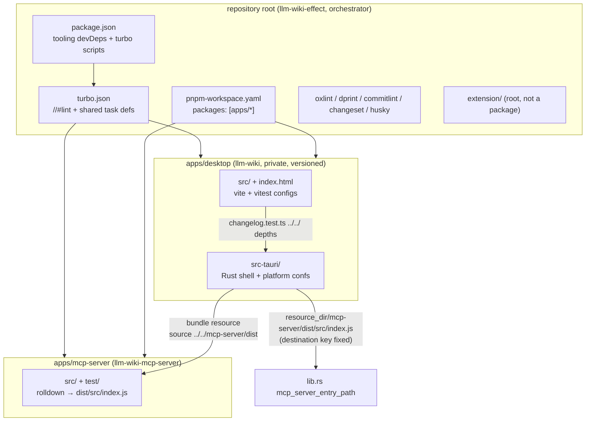

# Monorepoify into apps/ - Plan

## Goal Capsule

- **Objective:** A contributor, CI, and the release machinery all operate on a pnpm workspace whose two apps live under `apps/` — the Tauri desktop app and the MCP server — with the repository root reduced to a pure orchestrator, every gate still honest, and zero runtime behavior change.
- **Means:** Restructure the workspace per the `systemfsoftware/are-the-types-wrong-effect` layout conventions: `packages: ["apps/*"]`, per-app manifests, thin root scripts over the turbo task graph (KTD2, KTD5).
- **Authority hierarchy:** This plan governs. Repo doctrine (`AGENTS.md`) is edited as directed by this task — the user's monorepoify request is the explicit direction that lifts its read-only status for the touched rows.
- **Stop conditions:** Any finding that the two-app split cannot preserve the Tauri resource bundle contract (R4) stops the plan as blocked. Everything else is a path or config edit.
- **Execution profile:** Single branch, one PR. `ce-work` executes U1–U6 in dependency order; verification is gate-based (`pnpm check:ci`) plus the planted-defect probes in the Verification Contract.

---

## Product Contract

### Summary

The repository is today a pnpm workspace of two projects where the root package **is** the desktop app (`packages: [".", "mcp-server"]`). This plan moves the desktop app to `apps/desktop/` and the MCP server to `apps/mcp-server/`, renames the root package to a versionless orchestrator, and re-points every path-bearing config, workflow, and doc. Package names, gate commands, and runtime behavior stay unchanged.

### Problem Frame

The root-is-app shape couples app identity (name, version, dependencies) to the workspace root, blocks the standard `apps/*` convention this organization uses elsewhere, and makes the root's tooling typecheck ride the app's tsconfig. The inspiration repo demonstrates the target conventions; this repo's own solution docs record where those conventions must **not** be copied (changeset flow, lint preset, POSIX gate accumulator).

### Requirements

- R1. Exactly two app packages exist under `apps/`: `apps/desktop` (the Tauri app: `src/`, `src-tauri/`, `index.html`, vite/vitest configs, app tsconfigs) and `apps/mcp-server` (the MCP server package, directory renamed from `mcp-server/`).
- R2. Workspace package names are unchanged: the app stays `llm-wiki`, the server stays `llm-wiki-mcp-server`. The root package is renamed `llm-wiki-effect`, `private: true`, with no `version` field and no runtime dependencies.
- R3. Every path-bearing config is re-pointed in the same change: `pnpm-workspace.yaml`, root `package.json`, new `apps/desktop/package.json`, `turbo.json`, `oxlint.config.ts`, `dprint.json`, `commitlint.config.ts`, `.gitignore`, `scripts/sync-app-version.mjs`, `.github/workflows/ci.yml`, `.github/workflows/build.yml`, `.github/workflows/changeset.yml`, `.github/dependabot.yml`, `.github/scripts/package-windows-portable.ps1`.
- R4. Runtime behavior is unchanged: the bundled app still contains `<resource_dir>/mcp-server/dist/src/index.js` and `<resource_dir>/mcp-server/package.json`; the dev-time MCP entry probe in `apps/desktop/src-tauri/src/lib.rs` still resolves without a bundle; the in-app version reporting still reads `0.6.11` from the app manifest.
- R5. The gates stay honest: `pnpm check:ci` passes; the Changeset job still fires on app changes; the turbo task census shows no phantom tasks; cache inputs still cover the trees each task reads.
- R6. `pnpm-lock.yaml` is regenerated (importers keyed `apps/desktop`, `apps/mcp-server`) and committed in the same change as the moves.
- R7. Docs that assert the old layout are updated: `AGENTS.md`, `CONTRIBUTING.md`, `README.md` (+ translations), `apps/mcp-server/README.md`, and the two falsified solution docs.

### Success Criteria

- `pnpm check:ci` green locally and on all three CI platforms.
- `pnpm exec turbo run lint typecheck test:mocks llm-wiki-mcp-server#test --dry=json` reports exactly seven tasks with no phantom entries (see KTD6).
- A node one-liner resolves the platform-conf resource source path to `apps/mcp-server/dist/src/index.js` (Verification Contract V4).
- `node scripts/sync-app-version.mjs` completes with all three targets matched at the new paths.
- A changeset intent for the app change is committed (repo rule LW-6; bump `none` — this restructure ships no behavior change).

### Scope Boundaries

**Outside this restructure:**

- `extension/` stays at the repository root. It is not one of the two apps; it has no package.json and no workspace membership.
- `repos/`, `subtrees.toml`, `.config/wt.toml`, `nix/`, `bin/dprint.mjs`, `assets/`, `scripts/` stay at the root, untouched.
- No dependency version changes, no tool upgrades, no CI workflow redesign, no Rust code edits.

**Deferred to follow-up work:**

- Per-package `oxlint.config.ts` fan-out (the inspiration's convention) — rejected for now by KTD4, revisit only if the single root config becomes a real constraint.
- Adopting the inspiration's `.changeset/ledger.yaml` pnpm-native flow — refused permanently unless the changesets decision is revisited (see `docs/solutions/tooling-decisions/changesets-version-a-private-app.md`).

### Dependencies

- Inspiration repo conventions: `systemfsoftware/are-the-types-wrong-effect` @ `1b09691`.
- Institutional constraints: `docs/solutions/tooling-decisions/turbo-owns-the-task-graph.md`, `changesets-version-a-private-app.md`, `the-lint-surface-excludes-vendored-subtrees.md`, `the-lint-surface-is-stack-specific.md`, `the-conflict-preflight-is-the-merge-tree-exit-status.md`.

---

## Planning Contract

### Key Technical Decisions

- KTD1. **`src/` and `src-tauri/` move together into one app package `apps/desktop`.** Three relative-depth contracts are preserved by co-location and would each break under a split: `src/lib/changelog.test.ts` resolves `../../package.json` and `../../src-tauri/{tauri.conf.json,Cargo.toml}` from `src/lib/` (unchanged depth inside `apps/desktop`); `tauri.conf.json` resolves `frontendDist: "../dist"` and `beforeBuildCommand: "pnpm build:desktop"` relative to the package root; `lib.rs`'s `CARGO_MANIFEST_DIR/../..` probe walks `apps/desktop/src-tauri → apps/desktop → apps` and lands on `apps/mcp-server` in dev. (Evidence-chosen over splitting UI and Rust shell into separate packages: the version-skew guard test, the tauri config relatives, and the dev probe all measure the co-located depth today — split locations would each need re-derivation with no offsetting gain.)
- KTD2. **Package names stay `llm-wiki` and `llm-wiki-mcp-server`; only the root renames (to `llm-wiki-effect`).** Every package-name-keyed artifact survives untouched: turbo task keys (`llm-wiki#test:mocks`, `llm-wiki-mcp-server#test`), root `mcp:*` scripts, `.changeset/config.json` `ignore: ["llm-wiki-mcp-server"]`, the `Cargo.lock` crate-name anchor `llm-wiki` in `sync-app-version.mjs`, and the `llm-wiki` bin/npm identities. Chosen over renaming to `@llm-wiki/*` scope: a rename would have to be threaded through changesets ignore, commitlint tooling regexes, and docs in the same change for zero benefit.
- KTD3. **The root becomes a pure orchestrator: no `version`, no runtime dependencies, orchestrating scripts only.** All app dependencies and the app scripts (`dev`, `build`, `preview`, `test*`, `typecheck`, `tauri`, `build:desktop`) move to `apps/desktop/package.json`; root keeps only tooling devDependencies (changesets, commitlint trio, dprint, husky, lint-staged, oxlint, oxlint-tsgolint, turbo, typescript) and delegating scripts. Changesets cannot version the root in the target shape: `@changesets/cli` enumerates members via `@manypkg/get-packages`, which returns the root as a separate `rootPackage` used only for dependency-range rewrites, and a package without a `version` field is skipped by `shouldSkipPackage` outright — so `.changeset/config.json` needs no new ignore entry (verify with `pnpm changeset status`).
- KTD4. **One root `oxlint.config.ts` and one root `dprint.json` stay; per-package configs are not adopted.** Both configs' path glob lists become depth-free (`**/src-tauri/**`, `**/dist/**`, `**/repos/**`, …) so they grade the moved trees; `.lintstagedrc.js` keeps its root-anchored `oxlint --fix` invocation, so pre-commit and `pnpm lint` grade a staged file with the same config. Refused from the inspiration: its per-package `oxlint.config.ts` fan-out and its `@systemfsoftware/all` preset, which bans `node:*` imports that `src/lib`, the MCP server, and the build configs depend on (`the-lint-surface-is-stack-specific.md`). Chosen over per-package configs: one config cannot disagree with itself, and lint-staged needs no package-root walk.
- KTD5. **Root scripts keep their exact names and delegate.** Turbo wrappers: `test:mocks`, `build`, `build:desktop`, `mcp:*`, `gate:tasks`, `gate:dist` (unchanged invocations). `pnpm --filter llm-wiki <script>` delegation: `dev`, `tauri`, `test:llm` (`--filter` runs the script in the member's directory, so `pnpm --filter llm-wiki tauri dev` finds `apps/desktop/src-tauri`). `lint` stays a root `oxlint .` invocation over the whole repo. `check:ci` stays `node scripts/check-ci.mjs format:check gate:tasks gate:dist` — the Node accumulator exists because the POSIX form is a syntax error under cmd.exe (`scripts/check-ci.mjs`); the inspiration's `s=0; … || s=1` form and its `turbo --concurrency=${TURBO_CONCURRENCY:-50%}` form are refused on that recorded evidence. No wrapper recursion is possible: turbo selects the root package's script for an unqualified task only when that task also has a `//#`-registered definition (measured on the repo's turbo 2.10.12: bare `turbo run <task>` excluded the root package's script until a `//#<task>` def was added), and neither `//#test:mocks` nor `//#build` will be registered.
- KTD6. **`turbo.json`: register `//#lint` and `//#typecheck`; every other key keeps its shape.** Turbo root-task semantics, verified empirically against the repo's own turbo 2.10.12 (probes E1–E9, see Sources): an unqualified `turbo run <task>` selects only `apps/*` members' scripts; the root package joins the selection only when the task has a `//#<task>` definition registered; an invocation naming a task with no definition at all hard-errors. Therefore: replace `llm-wiki#lint` with a registered `//#lint` whose inputs are `["$TURBO_DEFAULT$", "!**/*.md", "!**/repos/**", "!**/src-tauri/**", "apps/*/src/**", "apps/*/test/**", "apps/*/*.ts", "apps/*/*.json", "apps/*/index.html", "extension/**/*.js"]` — the positives enumerate the trees outside the root package that root oxlint reads (app sources, tests, app-root configs, index.html, extension scripts); the depth-free negations keep the vendored `repos/` tree and the Rust tree out of the hash exactly as `!repos/**`/`!src-tauri/**` do today (the root package's `$TURBO_DEFAULT$` spans everything at the repo root outside `apps/*`, `repos/` included; a stale or over-broad input set is the failure class `the-vacuous-pass-gate-input-sets.md` names). Add a registered `//#typecheck` with inputs `["$TURBO_DEFAULT$", "!**/*.md", "!**/repos/**"]` so gate:tasks' bare `typecheck` covers root tooling + app + mcp-server without keying on vendored churn. Leave `build`, `llm-wiki#test:mocks`, `llm-wiki-mcp-server#test` untouched: their `inputs`/`outputs` globs resolve relative to each owning package (`turbo` docs; verified), so `!src-tauri/**` keeps excluding `apps/desktop/src-tauri/**` and a stale-looking `!repos/**` is a harmless no-op inside member packages. Do NOT register `//#build` or `//#test:mocks`, which keeps the root's wrapper scripts out of every bare selection. `dependsOn: ["^build"]` stays **out** — the workspace still has zero package edges; the app bundles the MCP server as a Tauri resource, not a workspace dependency. Gate census rises from six scheduled tasks today to seven: `lint` → root (1) + `typecheck` → root/app/mcp-server (3) + `test:mocks` → app (1) + `llm-wiki-mcp-server#test` (1) + its `dependsOn` `llm-wiki-mcp-server#build` (1).
- KTD7. **Tauri platform resource maps: source keys gain one `..`, destination keys stay fixed.** In `tauri.{linux,macos,windows}.conf.json`, sources `"../mcp-server/package.json"` and `"../mcp-server/dist"` become `"../../mcp-server/…"` (from `apps/desktop/src-tauri`, the sibling app is at `apps/mcp-server`). The destinations `"mcp-server/…"` must not change: Tauri's map form preserves relative paths into `<resource_dir>`, and `lib.rs` joins `resource_dir + "mcp-server/dist/src/index.js"`. This is the highest-risk edit class in the migration — a wrong source path is a Tauri warning, not a build failure, and surfaces only as a user-facing `mcpPathError`.
- KTD8. **The app manifest stays the version source of truth, now at `apps/desktop/package.json`.** `scripts/sync-app-version.mjs` target paths become `apps/desktop/src-tauri/{tauri.conf.json,Cargo.toml,Cargo.lock}` (repo-root join unchanged); `build.yml`'s two `require('./package.json')` reads (portable-zip version, extension manifest version) read `./apps/desktop/package.json`; `src/lib/changelog.test.ts` needs no edit (KTD1). The extension continues to take the app's version.
- KTD9. **Verification leans on planted defects, not green-check trust.** Per the corpus's anti-vacuity rule, the move is proven by: a turbo dry-run task census (no phantoms), a cache A/B probe (edit one app source file → only app tasks miss), a resource-path resolution assertion, a `version:sync` dry pass, and a dev-mode Tauri smoke (best-effort on Linux; the CI `cargo build` leg is the guaranteed compile check).

### High-Level Technical Design

Target topology and the resource-path coupling that constrains it:



### Output Structure

```text
apps/
  desktop/            # package "llm-wiki" (was the root)
    package.json      # app deps + dev/build/test/typecheck/tauri scripts
    index.html
    vite.config.ts
    vitest.llm.config.ts
    tsconfig.json     # references app + node projects
    tsconfig.app.json
    tsconfig.node.json  # vite.config.ts only
    components.json
    src/              # React UI (moved verbatim)
    src-tauri/        # Rust shell (moved verbatim; pdfium/, icons/, capabilities/)
  mcp-server/         # package "llm-wiki-mcp-server" (was mcp-server/)
    src/ test/ README.md rolldown.config.js tsconfig*.json package.json
package.json         # root orchestrator "llm-wiki-effect"
turbo.json
pnpm-workspace.yaml  # packages: [apps/*]
tsconfig.json        # root solution: references tsconfig.node.json only
tsconfig.node.json   # commitlint.config.ts + oxlint.config.ts
```

Everything else at the root stays where it is.

---

## Implementation Units

### U1. Split the workspace: create `apps/desktop` and `apps/mcp-server`

- **Goal:** The two app packages exist under `apps/` with correct manifests; the root is a versionless orchestrator; the lockfile matches.
- **Requirements:** R1, R2, R6.
- **Dependencies:** none.
- **Files:** `apps/desktop/**` (moved: `src/`, `src-tauri/`, `index.html`, `vite.config.ts`, `vitest.llm.config.ts`, `tsconfig.app.json`, `components.json`; new: `package.json`, `tsconfig.json`, `tsconfig.node.json`), `apps/mcp-server/**` (moved from `mcp-server/`), `package.json`, `tsconfig.json`, `tsconfig.node.json`, `pnpm-workspace.yaml`, `pnpm-lock.yaml`.
- **Approach:**
  1. `git mv` the desktop-app files into `apps/desktop/`; `git mv mcp-server apps/mcp-server`.
  2. Create `apps/desktop/package.json`: name `llm-wiki`, version `0.6.11`, `private: true`, `type: module`; scripts `dev`, `build`, `preview`, `build:desktop: turbo run typecheck build`, `test`, `test:mocks: vitest run`, `test:llm`, `typecheck: tsc --build --pretty`, `tauri: tauri`; move the root `dependencies` block and the app-side devDependencies (`@tauri-apps/cli`, `@types/node`, `@types/react`, `@types/react-dom`, `@vitejs/plugin-react`, `fast-check`, `vite`, `vitest`), preserving every `catalog:` reference verbatim.
  3. Create `apps/desktop/tsconfig.json` (same shape as today's root: `files: []`, references to `tsconfig.app.json` + `tsconfig.node.json`) and `apps/desktop/tsconfig.node.json` (include `["vite.config.ts"]` only).
  4. Rewrite root `package.json`: name `llm-wiki-effect`, drop `version`; keep exactly the tooling devDependencies — `@changesets/cli`, `@commitlint/cli`, `@commitlint/config-conventional`, `@commitlint/types`, `dprint`, `husky`, `lint-staged`, `oxlint`, `oxlint-tsgolint`, `turbo`, `typescript` — all `catalog:` (KTD3; `bin/dprint.mjs` resolves the root `node_modules`, so these must stay root-owned); scripts per KTD5 (`dev`/`tauri`/`test:llm` via `pnpm --filter llm-wiki …`; `build`, `test:mocks`, `mcp:*`, `gate:*`, `check:ci`, `format:*`, `lint`, `changeset*`, `version:sync`, `release:version`, `precommit`, `prepare` unchanged in shape).
  5. Rewrite root `tsconfig.json` (references `tsconfig.node.json` only; drop the stale `@/*` paths block) and root `tsconfig.node.json` (include `["commitlint.config.ts", "oxlint.config.ts"]`; carry `compilerOptions` across unchanged).
  6. `pnpm-workspace.yaml`: `packages: ["apps/*"]`; keep the catalog, `catalogMode`, `minimumReleaseAge`, `allowBuilds` blocks; update the root-listing comment.
  7. Run `pnpm install` to regenerate `pnpm-lock.yaml` (importers become `apps/desktop`, `apps/mcp-server`).
- **Patterns to follow:** the inspiration repo's root-manifest shape (`private`, no version, no dependencies); the current root `package.json` script bodies.
- **Test scenarios:**
  - `pnpm install` exits 0 and `pnpm-lock.yaml` importers list exactly `.`, `apps/desktop`, `apps/mcp-server`.
  - `node -p "require('./apps/desktop/package.json').version"` prints `0.6.11`.
  - `pnpm ls --filter llm-wiki --depth 0` resolves the app package with its deps.
- **Verification:** lockfile importer keys correct; root `pnpm typecheck` compiles the root tooling project.

### U2. Re-point the task graph, lint/format surface, and release scripts

- **Goal:** Every non-CI path-bearing config targets the moved trees; the turbo graph schedules the same work with no phantoms and non-vacuous inputs.
- **Requirements:** R3, R5.
- **Dependencies:** U1.
- **Files:** `turbo.json`, `oxlint.config.ts`, `dprint.json`, `commitlint.config.ts`, `.gitignore`, `scripts/sync-app-version.mjs`.
- **Approach:**
  1. `turbo.json` per KTD6: `llm-wiki#lint` → registered `//#lint` with inputs `["$TURBO_DEFAULT$", "!**/*.md", "!**/repos/**", "!**/src-tauri/**", "apps/*/src/**", "apps/*/test/**", "apps/*/*.ts", "apps/*/*.json", "apps/*/index.html", "extension/**/*.js"]`; add registered `//#typecheck` with inputs `["$TURBO_DEFAULT$", "!**/*.md", "!**/repos/**"]`; leave `build`, `llm-wiki#test:mocks`, `llm-wiki-mcp-server#test` untouched (their package-relative negations still resolve correctly); register nothing else with a `//#` prefix.
  2. `oxlint.config.ts`: `ignorePatterns` → depth-free forms (`'**/src-tauri/**'`, `'**/dist/**'`, `'**/dist-test/**'`, `'**/dist-rc/**'`, `'**/dist-portable/**'`, `'**/coverage/**'`, `'**/reports/**'`, `'**/repos/**'`); keep `extension/*` overrides at their current root-relative paths.
  3. `dprint.json`: `excludes` — `"src-tauri/**"` → `"**/src-tauri/**"`, `"repos/**"` → `"**/repos/**"`; the rest is already depth-free.
  4. `commitlint.config.ts` `isTooling`: `^src-tauri/tauri\..*\.json$` → `^apps/desktop/src-tauri/tauri\..*\.json$`; `^src-tauri/Cargo\.toml$` → `^apps/desktop/src-tauri/Cargo\.toml$`.
  5. `.gitignore`: `src-tauri/target/` → `apps/desktop/src-tauri/target/`; `src-tauri/gen/` → `apps/desktop/src-tauri/gen/`.
  6. `scripts/sync-app-version.mjs`: prefix the three target paths with `apps/desktop/`, and point the version read at the app manifest — `readAppVersion`'s `join(root, 'package.json')` becomes `join(root, 'apps/desktop/package.json')`, realizing KTD8's "version source of truth, now at `apps/desktop/package.json`"; the repo-root resolution line stays.
  7. `.changeset/config.json`: no change (KTD3) — verify `pnpm changeset status` runs clean.
- **Patterns to follow:** the depth-free exclude convention already used for `**/dist` in `dprint.json`.
- **Test scenarios:**
  - `pnpm exec turbo run lint typecheck test:mocks llm-wiki-mcp-server#test --dry=json` schedules exactly seven tasks (KTD6 census), none phantom.
  - `pnpm lint` reports no findings inside `apps/desktop/src-tauri/**` or `repos/**` (exclusions hold).
  - `pnpm format:check` exits clean from a clean worktree (formatter does not reach `Cargo.lock`, `src-tauri/`, or `repos/`).
  - A scratch commit touching only `apps/desktop/src-tauri/tauri.windows.conf.json` classifies as tooling under commitlint (`isTooling` matches).
- **Verification:** census count matches KTD6; gates green.

### U3. Re-point the Tauri resource coupling and prove both MCP paths

- **Goal:** The bundled and dev-time MCP entry paths both resolve at the new depth, with an executable assertion.
- **Requirements:** R4.
- **Dependencies:** U1.
- **Files:** `apps/desktop/src-tauri/tauri.linux.conf.json`, `apps/desktop/src-tauri/tauri.macos.conf.json`, `apps/desktop/src-tauri/tauri.windows.conf.json`; no Rust edits expected.
- **Approach:**
  1. In each platform conf, change the two resource **source** keys `"../mcp-server/package.json"` and `"../mcp-server/dist"` to `"../../mcp-server/…"`; leave destination keys `"mcp-server/…"` untouched (KTD7).
  2. `tauri.conf.json` needs no edit: `frontendDist: "../dist"` and the `beforeDevCommand`/`beforeBuildCommand` scripts resolve inside the app package (the app's `build:desktop` runs turbo, which finds the root graph).
  3. `lib.rs`'s dev probe needs no edit: `CARGO_MANIFEST_DIR/../..` now resolves `apps/desktop/src-tauri → apps/desktop → apps`, and `join(relative)` lands on `apps/mcp-server/dist/src/index.js`. Record this walk in the unit; change Rust only if the smoke in U6 disproves it.
  4. Add the executable assertion to U6's checklist (do not commit a scratch script).
- **Patterns to follow:** the pdfium resource-path note in `apps/desktop/src-tauri/src/commands/fs.rs` (map form preserves relative paths).
- **Test scenarios:**
  - After `pnpm mcp:build`, `node -e` resolving `path.resolve('apps/desktop/src-tauri', '../../mcp-server/dist/src/index.js')` confirms the file exists (source-key depth correct).
  - `apps/mcp-server/test/bundle.test.ts` still passes (it is layout-agnostic: it walks up to the nearest `package.json` from inside the package).
  - `apps/desktop/src/lib/changelog.test.ts` still passes unchanged (KTD1 depths hold).
- **Verification:** both path classes (bundle destination contract, dev probe) documented as verified; no `.rs` diff.

### U4. Re-point CI workflows, Dependabot, and the portable packager

- **Goal:** CI compiles, caches, gates, and packages from the new paths; no gate silently narrows.
- **Requirements:** R3, R5.
- **Dependencies:** U1, U2.
- **Files:** `.github/workflows/ci.yml`, `.github/workflows/build.yml`, `.github/workflows/changeset.yml`, `.github/dependabot.yml`, `.github/scripts/package-windows-portable.ps1`.
- **Approach:**
  1. `ci.yml`: `Swatinem/rust-cache` `workspaces: apps/desktop/src-tauri`; `Check Rust build` `working-directory: apps/desktop/src-tauri`. Turbo cache key and `install-deps` action unchanged.
  2. `build.yml`: `workspaces: apps/desktop/src-tauri`; `shasum -a 256 -c apps/desktop/src-tauri/pdfium/SHA256SUMS`; ARM swap copies under `apps/desktop/src-tauri/pdfium/`; bundle artifact globs `apps/desktop/src-tauri/target/**/release/bundle/…`; both `node -p "require('./apps/desktop/package.json').version"` reads (portable zip, extension manifest).
  3. `changeset.yml`: `paths` → `apps/desktop/src/**`, `apps/desktop/src-tauri/**`, `extension/**`, `apps/mcp-server/**`, `scripts/**`; keep the comment and gate logic byte-identical otherwise.
  4. `dependabot.yml`: cargo `directory: /apps/desktop/src-tauri`; add two `package-ecosystem: npm` entries with `directory: /apps/desktop` and `directory: /apps/mcp-server`, each carrying the group definitions that applied to the moved manifests (react/tauri/testing/types groups per current config); keep the root `/` npm entry for the tooling devDependencies — explicit directories are unambiguous even if the `/` entry traverses workspace members.
  5. `package-windows-portable.ps1`: `$RepoRoot/src-tauri/…` → `$RepoRoot/apps/desktop/src-tauri/…` (exe, pdfium.dll); `$RepoRoot/mcp-server/…` → `$RepoRoot/apps/mcp-server/…`. The staged layout inside the zip (`mcp-server/`, `pdfium/`) stays byte-identical — `lib.rs`/`commands/fs.rs` look those names up next to the exe at runtime.
- **Patterns to follow:** comment discipline already present in these workflows (each edit keeps or updates its explanatory comment).
- **Test scenarios:**
  - Every `path:`/`directory:`/glob string in the five files matches at least one tracked file at the new layout (`git ls-files` spot checks).
  - The changeset paths list still excludes `package.json` and `pnpm-lock.yaml` (the dependabot-stall trap the comment warns about).
- **Verification:** actionlint or `gh workflow view` parse check; paths enumerated in the PR description.

### U5. Update doctrine, contributor docs, and falsified solution docs

- **Goal:** No doc asserts a layout that no longer exists.
- **Requirements:** R7.
- **Dependencies:** U1–U4 (docs describe the settled shape).
- **Files:** `AGENTS.md`, `CONTRIBUTING.md`, `README.md`, `README_KO.md`, `README_JA.md`, `README_CN.md`, `apps/mcp-server/README.md`, `docs/solutions/tooling-decisions/turbo-owns-the-task-graph.md`, `docs/solutions/tooling-decisions/changesets-version-a-private-app.md`.
- **Approach:**
  1. `AGENTS.md`: Layout section — `src/` → `apps/desktop/src/`, `src-tauri/` → `apps/desktop/src-tauri/`, `mcp-server/` → `apps/mcp-server/` (note the root is now an orchestrator); Boundaries table Editable rows → `apps/desktop/src/**`, `apps/desktop/src-tauri/src/**`, `apps/mcp-server/**`; keep Vendored (`apps/desktop/src-tauri/pdfium/**`) and Evaluator rows accurate. The user's monorepoify request is the explicit direction authorizing these doctrine edits.
  2. `CONTRIBUTING.md`: changeset-gated paths and sync-target paths per U2/U4.
  3. READMEs and CONTRIBUTING.md prose: the `pnpm mcp:build` resource comment; quick-start/Commands blocks (`pnpm tauri dev`, `pnpm tauri build`, `pnpm dev` still valid as KTD5 delegation wrappers — verify each named script survives at root); CONTRIBUTING's changeset-gated paths (`src/**` → `apps/desktop/src/**`, `src-tauri/**` → `apps/desktop/src-tauri/**`) and sync-target paths; AGENTS.md's sentence "`src/lib/changelog.test.ts` holds those three equal to `package.json`" → "`apps/desktop/package.json`"; `apps/mcp-server/README.md`'s client-config example path → `apps/mcp-server/dist/src/index.js`.
  4. `turbo-owns-the-task-graph.md`: rewrite the Context premise ("exactly two projects… root lives at the repository root") for three projects; update the qualified-task-key list (`//#lint`), the task census (six → seven), the input-narrowing examples' paths, and the input-narrowing justification (which config excludes which tree after U2: depth-free `ignorePatterns` in `oxlint.config.ts`, `tsconfig.app.json` scoped inside `apps/desktop`, root tooling tsconfig carrying only `commitlint.config.ts` + `oxlint.config.ts`). This doc's rules survive; only its layout facts change.
  5. `changesets-version-a-private-app.md`: update the workspace-listing premise — the app is now an ordinary glob-listed member; the root is no longer listed and cannot be versioned at all.
- **Patterns to follow:** solution-doc upkeep convention (`docs/solutions/**` is editable; update falsified claims in place, keep the decisions).
- **Test scenarios:**
  - `grep -rnE '(^|[^a-z-])(src/|src-tauri/|mcp-server/)' AGENTS.md CONTRIBUTING.md README*.md docs/solutions` returns only intentional historical references (e.g. quoted old layout in a dated example).
  - `pnpm format:check` stays clean after doc edits.
- **Verification:** no doc contradicts the tree; `ce-compound`-style review confirms decisions preserved.

### U6. Prove the migration: gates, census, probes, smoke

- **Goal:** Every R5 success criterion demonstrated on the moved tree.
- **Requirements:** R4, R5; Success Criteria.
- **Dependencies:** U1–U5.
- **Files:** none (verification only; throwaway probes deleted after).
- **Approach:**
  1. Full gate: `pnpm check:ci`.
  2. Census: `pnpm exec turbo run lint typecheck test:mocks llm-wiki-mcp-server#test --dry=json` → seven tasks (KTD6).
  3. Cache A/B: record `--dry=json` hashes; touch `apps/desktop/src/lib/` one file; re-dry → only app `typecheck`/`test:mocks`/`build` hashes move; touch `apps/desktop/src-tauri/src/lib.rs` → no JS-task hash moves (lint input exclusion works).
  4. Resource assertion from U3.
  5. `node scripts/sync-app-version.mjs` → all three targets matched, no change written.
  6. `pnpm mcp:test` (bundle handshake) and `pnpm test:mocks` (changelog depths) green.
  7. Dev smoke (best-effort): `pnpm --filter llm-wiki tauri dev`, open Settings, confirm the MCP server path resolves (no `mcpPathError`). On a headless environment, substitute: `cargo build` in `apps/desktop/src-tauri` (the CI leg) plus the U3 assertion, and record that the GUI smoke did not run.
  8. Changeset: add `.changeset/<name>.md` with `"llm-wiki": "none"` per the gate's own convention for behavior-invisible changes; `pnpm changeset status` clean.
  9. Delete every scratch probe; `git status` clean.
- **Verification:** all success criteria checked off with observed output.

---

## Verification Contract

| id                                                                                                                                                                                                                                                                                                                                                                                                                                                                                                   | Check                | Command / method                                                                              | Proves        |
| ---------------------------------------------------------------------------------------------------------------------------------------------------------------------------------------------------------------------------------------------------------------------------------------------------------------------------------------------------------------------------------------------------------------------------------------------------------------------------------------------------- | -------------------- | --------------------------------------------------------------------------------------------- | ------------- |
| V1                                                                                                                                                                                                                                                                                                                                                                                                                                                                                                   | Full gate            | `pnpm check:ci`                                                                               | R5, LW-1…LW-5 |
| V2                                                                                                                                                                                                                                                                                                                                                                                                                                                                                                   | Task census          | `pnpm exec turbo run lint typecheck test:mocks llm-wiki-mcp-server#test --dry=json` → 7 tasks | R5, KTD6      |
| V3                                                                                                                                                                                                                                                                                                                                                                                                                                                                                                   | Cache non-vacuity    | A/B dry-run hash diff per KTD9 probe 3                                                        | R5            |
| V4                                                                                                                                                                                                                                                                                                                                                                                                                                                                                                   | Resource source path | node resolve of `apps/desktop/src-tauri` + `../../mcp-server/dist/src/index.js`               | R4, KTD7      |
| V5                                                                                                                                                                                                                                                                                                                                                                                                                                                                                                   | Version sync         | `node scripts/sync-app-version.mjs` (no-op pass)                                              | R4, KTD8      |
| V6                                                                                                                                                                                                                                                                                                                                                                                                                                                                                                   | MCP runtime contract | `pnpm mcp:test` bundle handshake                                                              | R4            |
| V7                                                                                                                                                                                                                                                                                                                                                                                                                                                                                                   | Tauri compile        | `cargo build` in `apps/desktop/src-tauri` (local) + CI legs                                   | R4            |
| V8                                                                                                                                                                                                                                                                                                                                                                                                                                                                                                   | Dev smoke            | `pnpm --filter llm-wiki tauri dev` → Settings MCP path OK (best-effort)                       | R4            |
| V9                                                                                                                                                                                                                                                                                                                                                                                                                                                                                                   | Changeset gate       | changeset intent committed; `pnpm changeset status`; Changeset job green on the PR            | R5, LW-6      |
| Test-layer classification (admission gate, `choose-test-layer` step 0): this migration authors **zero** new tests. Every V-row is a gate-command proof or an existing suite consumed unchanged (`apps/mcp-server/test/bundle.test.ts` and `apps/desktop/src/lib/changelog.test.ts` already exist and keep their placement). V4 is a one-shot command proof, deliberately not persisted as a test: a permanent assertion would pin config text, not behavior, and the admission gate would refuse it. |                      |                                                                                               |               |

---

## Definition of Done

- V1–V9 observed and recorded; every scratch probe removed; working tree clean.
- All requirements R1–R7 traced to a unit and verified.
- Committed as `refactor(repo): move the desktop app and MCP server under apps/` (scope enum includes `repo`); lockfile in the same commit as the moves (R6).
- Changeset intent present (LW-6).
- Leftover-code criterion: no dead scripts, aliases, or stale-path shims remain — the old root-app scripts and paths are gone, not commented out.

---

## Assumptions

- Directory names `apps/desktop` and `apps/mcp-server` (the user specified `apps/*` with two apps but not names; role-named directories match the inspiration's `<product>-<role>` spirit at minimum churn).
- Root package name `llm-wiki-effect` matches the repository/product name, per the inspiration's root-naming convention.
- `typescript` stays in both root and app devDependencies via `catalog:` (root needs it for the tooling tsconfig and type-aware oxlint; the app needs its own `tsc`); identical catalog version prevents drift.
- The dev GUI smoke is achievable on this Linux workstation; if webkit deps are unavailable, V7 + V4 substitute and the substitution is recorded.

## Open Questions

None blocking. The one watch item: if the U6 dev smoke disproves the `lib.rs` probe-walk analysis (KTD1, U3 approach step 3), the fix is a one-line candidate-depth change in `apps/desktop/src-tauri/src/lib.rs` — scoped, evidence-backed, and does not reopen the plan.

## Sources & Research

- Wiring enumeration, gap table G-1…G-23, and directive checks: `agent://plan-research-1`, `agent://plan-research-4` (session research, 2026-09-13).
- Solution-corpus distillation (task-graph, changesets, lint-surface, preflight constraints): `agent://plan-research-2`.
- Inspiration-repo anatomy (workspace topology, root manifest, turbo defs, CI shapes, borrow/refuse table): `agent://plan-research-3`.
- Changesets/pnpm/turbo framework evidence (root-package non-versionability, `//#task` syntax, package-relative input globs, `--filter` CWD): `artifact://39`.

Turbo root-task selection semantics (KTD5/KTD6): measured directly on this repo's pinned turbo 2.10.12 via a scratch pnpm workspace (probes E1–E9, session 2026-09-13): bare `turbo run <task>` excludes the root package's script (E2, E5); registering `//#<task>` pulls the root into the unqualified selection (E1 vs E5, E8: 2 packages selected); invoking a task with no definition hard-errors regardless of root scripts (E3, E9). Official docs corroborate the registration requirement: turborepo.dev/docs/crafting-your-repository/configuring-tasks, "Registering Root Tasks".
