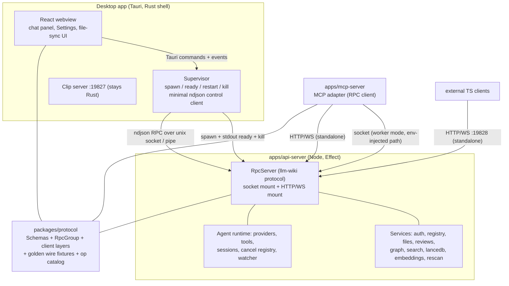
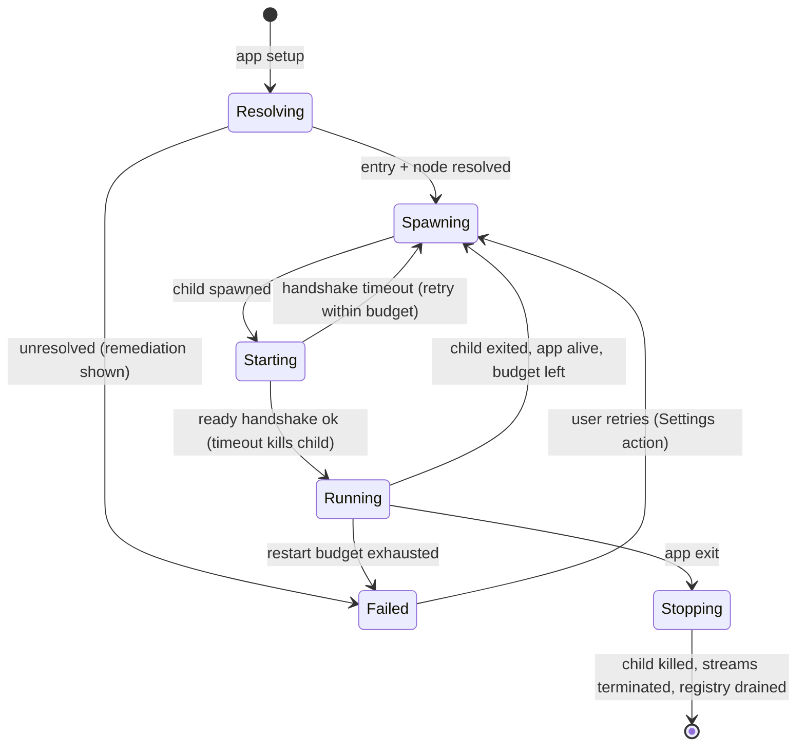
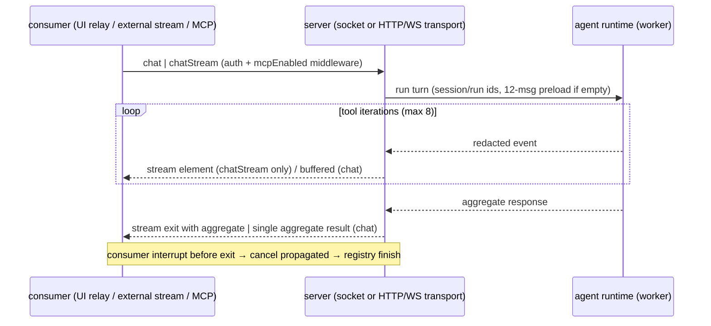

## Product Contract

### Summary

Replace the desktop-embedded Rust HTTP API server (`apps/desktop/src-tauri/src/api_server.rs`, the `agent/` runtime, and four `commands/` backends) with a standalone, deployable Effect RPC server: a new `packages/protocol` (Schema contracts, the RPC group, wire fixtures) and `apps/api-server` (Node ≥20, `effect/unstable/rpc`). Effect RPC replaces the REST API: the `/api/v1` surface and its SSE framing are retired, and the RPC protocol is the only external contract — served over a local socket in desktop-worker mode and over HTTP (POST + WebSocket for streams) in standalone mode with token auth. The MCP server re-targets the RPC protocol. All API-backed logic ports once to TypeScript/Effect and the Rust originals are deleted — no parallel implementations.

### Problem Frame

The API that powers MCP today is an in-process facade of the desktop app (`api_server.rs`): it shares Tauri state singletons, reads the desktop's `app-state.json`, runs the agent runtime on the desktop's Tokio pool, and dies with the app. Consequences: the API cannot be deployed where users actually run agents; the MCP server requires the desktop app running; every API capability drags Tauri/Rust coupling; and the ~32k-line Rust backend is duplicated surface that TypeScript consumers can never share. The user directed a full refactor to Effect RPC at the `github.com/systemfsoftware/systemfsoftware` bar, the server ripped out and deployable standalone, the desktop running it as a worker over IPC — and, by correction, RPC replacing REST rather than layering on top of it.

### Key Decisions

- **Full endpoint parity in this refactor, agent chat included** (session-settled: user-directed — chosen over a staged cut-line deferring chat: the agent runtime is the deepest coupling; leaving it Rust preserves the two-implementation problem the refactor exists to kill). Governs R5, R6.
- **Effect RPC replaces the REST API; the RPC protocol is the sole wire contract** (session-settled: user-directed correction — chosen over keeping a REST facade on top of RPC: one protocol, no dual surface to keep in lockstep; breaking for REST consumers, migration documented in U20). Governs R3, R4.
- **Worker mode = child process over local IPC, no TCP listener; standalone serves HTTP/WebSocket** (session-settled: user-directed — chosen over an always-on loopback HTTP listener: the desktop must not silently become a network server). Governs R2.
- **Runtime: Node ≥20 npm-runnable workspace package** (session-settled: user-directed — chosen over a Bun-compiled single-file binary: matches the existing `apps/mcp-server` toolchain and Effect's Node platform layer). Governs R1, R2.
- **systemfsoftware/systemfsoftware is the style bar** (user-named resource): Effect Schema contracts, `Context.Service`/Layer discipline, tagged errors, turbo/oxlint gates. Governs R12.

### Requirements

**Architecture and deployment**

- R1. The API server runs as a standalone app with no desktop app present, serving the full RPC protocol over HTTP (POST for requests, WebSocket for streams) on 19828 with the existing token model (env token > store token; `Authorization: Bearer` carrier; constant-time compare).
- R2. The desktop app hosts no API server. It spawns the server as a supervised child process and communicates over local IPC (stdout ready handshake + Unix-domain-socket / named-pipe RPC channel); no TCP listener exists in worker mode.
- R3. The RPC protocol (`packages/protocol`) is the sole external wire contract: typed payloads and tagged errors per operation, streaming chat as an RPC stream. The REST `/api/v1` surface, SSE framing, `?token=` query auth, and its status-code taxonomy are retired as application semantics; transport-level concerns (connection limits, body caps, rate limiting) remain transport semantics. A migration note for REST consumers ships with the release (U20).
- R4. The MCP server keeps its 11 `llm_wiki_*` tools with unchanged schemas and result semantics, re-targeted from the REST client to the RPC protocol package (socket transport in desktop mode, HTTP/WebSocket standalone).

**Behavior parity**

- R5. Every current endpoint's observable behavior ports with parity: auth modes and kill switches (`enabled` off → every non-health operation refuses; `allowUnauthenticated` opens reads while chat/cancel/embed stay token-required; `health` always open), rate limit (120 req/s) and in-flight caps (64 requests / 8 chat streams / 4 embeds), body/file caps, project resolution (id / path / `current`), file allow-lists, review semantics, search scoring, graph building, page embed pipeline, and source rescan — expressed as typed errors where REST previously used status codes.
- R6. Agent chat parity: server-generated session/run ids when absent, 12-message history preload when a session id is given and history is empty, `persistSession` only when the caller supplied a session id, cancellation registry keyed (project, session, run) with cancel propagated on stream interruption, and redaction of internal event fields on every external surface.
- R7. `apiConfig.mcpEnabled` is enforced by the server on the MCP-mapped operations (typed `McpDisabled` error), closing the defect where enforcement lived only in the MCP adapter's health poll. `health` stays unauthenticated and ungated.

**Desktop integration**

- R8. Desktop features that consumed the in-process server work through the worker with equivalent UX: chat panel streaming, file-sync queue/changed events, Settings status and config round-trip (save → config visible to the server without app restart beyond the existing bind-host rule).
- R9. Config authority is unchanged: the desktop UI remains the sole writer of `app-state.json`; the worker receives the app-state path from the desktop at spawn (never guesses), reads it behind the 5s TTL cache, and a reload operation propagates saves immediately (Tauri command name `api_server_reload_config` preserved).
- R10. `current` project follows desktop project switches immediately (desktop pushes it to the worker); standalone resolves `current` from its own configuration.

**Process and craft**

- R11. Clean cutover: `api_server.rs`, `agent/*`, the ported `commands/{search,vectorstore,page_embedding,file_sync}` modules, and the retired `cors.rs` / `server_bind.rs` helpers (re-homed into the clip server per U16) are deleted in this refactor; no operation has both a Rust and a TS implementation at rest.

### Key Flows

- F1. Worker lifecycle — **Trigger:** desktop app starts. **Actors:** Rust supervisor, worker child. **Steps:** resolve entry + node binary → spawn child → child binds socket, prints ready handshake (protocol version, socket path, versions, app-state echo) → supervisor connects, reports `running` → on child exit while app lives: bounded restart; on app exit: kill child; on crash with open streams: terminal stream failure delivered to every open consumer and registry entries finished. **Covered by:** R2, R8; KTD6.
- F2. Chat turn — **Trigger:** MCP tool call (aggregate), external client (stream), desktop chat panel (stream relay). **Actors:** consumer, server (socket or HTTP/WS transport), agent runtime. **Steps:** auth + mcpEnabled middleware → session/run resolution + history preload → tool loop emitting redacted events on the stream → terminal aggregate; consumer interruption cancels the run through the registry. **Covered by:** R3, R5, R6; KTD8, KTD12.
- F3. Settings save round-trip — **Trigger:** user saves API settings. **Actors:** React UI, `project-store`, worker. **Steps:** UI writes `apiConfig` to `app-state.json` → UI invokes `api_server_reload_config` → supervisor forwards reload RPC → worker busts cache → health snapshot reflects new state. **Covered by:** R9; KTD6.
- F4. Project switch — **Trigger:** user switches project in the desktop. **Actors:** desktop UI, clip-server global, worker. **Steps:** desktop sets its current-project global → supervisor pushes `setCurrentProject` RPC → worker caches → subsequent `current`-addressed calls hit the new project. **Covered by:** R10; KTD6.

### Acceptance Examples

- AE1. **Auth matrix.** Covers R1, R5. Given token auth configured with no `allowUnauthenticated`, when an operation arrives with no token or a wrong token, then it fails with the typed `Unauthorized` error; with `allowUnauthenticated` on, reads succeed while chat, chat-cancel, and pages/embed still fail `Unauthorized`.
- AE2. **Traversal rejection.** Covers R5. Given any project, when file content is requested for `../app-state.json`, an absolute path, a dot-segment path, or a non-allow-listed extension, then each fails with the typed path-violation error and the resolved path never escapes the project root.
- AE3. **Worker crash mid-stream.** Covers R2, R6. Given an open streaming chat and the worker process dies, then the consumer's stream fails with a terminal error rather than hanging, and no cancellation-registry entry leaks.
- AE4. **Standalone boot.** Covers R1, R10. Given a machine with no desktop app and a project registry provided via server config, when `llm-wiki-api-server` starts, then `health` answers and every operation works over HTTP/WS against config-listed projects with `current` resolved from config.
- AE5. **MCP gating server-side.** Covers R7. Given `mcpEnabled=false` and a valid token, when an MCP-mapped operation is called, then the server returns `McpDisabled`, which the adapter maps to today's MCP error code and message text; `health` still answers.
- AE6. **Token rotation.** Covers R9. Given a running worker and a token change saved in Settings, when the next request uses the new token, then it is accepted without waiting for the 5s TTL.

### Success Criteria

- The protocol contract suite (in-process, real socket/HTTP transport) passes against the composed server layers with no desktop app and no child-process spawning in tests.
- The existing MCP bundle handshake test passes with the re-targeted client (its harness is unchanged by this plan).
- Turbo task census re-measured and recorded; planted-defect cache probe still fails honestly; `pnpm check:ci` green including both new packages; CI smoke scripts prove the built worker boots and completes a roundtrip from a resource-shaped layout.
- Port-fidelity oracles are the documented contracts and hand-derived fixture values — never captured Rust output (see the wrong/right block under Planning Contract assumptions).

### Scope Boundaries

**Out of scope (this refactor's identity)**

- The clip server (19827) and Chrome extension clipping path stay in Rust. Its `is_token_authorized` reuse is replaced by a local copy of the small constant-time check in `clip_server.rs`.
- Desktop-only Tauri commands stay Rust: `fs` UI operations, ebook, `extract_images`, pdfium, `file_history`, `claude_cli`/`codex_cli` streaming features, tray, proxy env plumbing.
- A REST compatibility shim for existing curl scripts — rejected by the RPC-replaces-REST decision; migration is documented, not bridged.
- npm publishing, releases, signing (repo Human-approval rule).

**Deferred to Follow-Up Work**

- OpenAPI/endpoint-discovery docs (the protocol package's method catalog, rendered in Settings, is the documented surface for now).
- New MCP tools beyond parity: `llm_wiki_chat_cancel` exposure and streaming MCP chat (client methods exist; tool surface unchanged per R4).
- Proxy live-toggle parity beyond env-var semantics in the worker.
- LAN/remote deployment hardening guide (TLS, reverse-proxy notes) beyond today's `allowLanAccess` behavior.
- Effect-flavored oxlint preset adoption in the shared base (measured-premise rule; docs/solutions/tooling-decisions/the-lint-surface-is-stack-specific.md).

---

## Planning Contract

### Key Technical Decisions

- KTD1. **Effect dependency: published `effect@4.0.0-rc.x` via pnpm catalog, importing `effect/unstable/rpc`.** Source: npm registry (verified this session — `effect@4.0.0-rc.115` exports `./unstable/rpc`) and the official v3→v4 migration map (`Effect-TS/effect-smol` `migration/v3-to-v4.md`: every `@effect/rpc/*` module maps to `effect/unstable/rpc/*`; v4 folds RPC into `effect`). Not `@effect/rpc` 0.76.x (v3-era, peers `effect ^3.22.1`) and not the bar repo's vendored fork (read-only reference). Pin the newest rc older than the workspace's `minimumReleaseAge: 1440` minutes; `@effect/platform-node` at the matching rc. Falsification record (U1): check the rc line's release notes for any stability commitment on `unstable/` and inventory which imported symbols are transport-side vs handler-side (the escape cost if a later move to a stable transport API is forced); the pin moves only via a deliberate, fixture-verified bump. Gate: `pnpm install` completes and `import { Rpc } from 'effect/unstable/rpc'` typechecks in U1.
- KTD2. **Transport topology: one `RpcServer`, two mounts; no REST layer anywhere.** Worker mode: `makeProtocolSocketServer` on a runtime-generated Unix-domain socket (Linux/macOS) or named pipe (Windows), user-only permissions, announced on stdout in the ready handshake; serialization ndjson. Standalone mode: `layerProtocolHttp` on 19828 — RPC over HTTP POST, with WebSocket upgrade for stream-heavy clients; token in `Authorization`. This instantiates the settled no-TCP decision in worker mode (a domain socket is local IPC, not a listener) and the bar repo's own production pattern (stryker `WorkerLauncher`: socket + ndjson client). Gate: in-process transport composition tests (U14) pass for both mounts.
- KTD3. **Shared protocol package `packages/protocol` (`llm-wiki-protocol`) owns the contract, including golden wire fixtures.** Schemas, the RPC group, tagged errors, client layer factories (socket + http), an operation catalog (consumed by Settings UI; marks the MCP-mapped operations), and ndjson envelope fixture files that both the TS tests and the Rust control client's tests consume — the polyglot drift surface becomes a tested contract rather than two informal implementations. Fixtures are checked-in files under `packages/protocol/fixtures/`; the Rust tests read them by path resolved from the crate manifest (`CARGO_MANIFEST_DIR/../../packages/protocol/fixtures` — the same manifest-relative probing pattern `lib.rs` uses for the MCP entry), no build step. This creates the workspace's first app↔package dependency edge: dependent packages' turbo `inputs` name `$TURBO_ROOT$/packages/protocol/src/**` (turbo-owns-the-task-graph law). Gate: fixture files parse identically from TS and Rust tests (U2, U16).
- KTD4. **Vector store: first-party `@lancedb/lancedb` (npm), pinned to the 0.27.x line matching the Rust crate `lancedb 0.27.2`.** Coincident wrapper versions do not by themselves prove on-disk compatibility, so the U7 spike verifies format provenance directly: both bindings report the Lance format version they read/write, and the spike opens a real Rust-written `.llm-wiki/lancedb` (v1 + v2 tables) from a resource-shaped layout. Native module external to the rolldown bundle; packaged builds ship a pruned `node_modules` subtree as a Tauri resource (distribution mechanism, not a compatibility fallback). If the spike cannot open Rust-written tables, the two real fallbacks are: (a) v1 keeps the vector store behind a Rust sidecar with a documented follow-up migration, or (b) this refactor accepts a one-time data migration — decided by the user at the spike, not silently. Gate: U7 spike result recorded before any phase-2 unit starts (Sequencing).
- KTD5. **Node runtime distribution: bundle a pinned Node binary as a Tauri resource for packaged builds; PATH `node` in dev.** pdfium precedent (`apps/desktop/src-tauri/src/commands/fs.rs` multi-path resolution). Missing/old runtime surfaces as the existing `error` status vocabulary with a remediation string. Gate: CI smoke script boots the worker from the resource layout without PATH node (U21).
- KTD6. **The Rust supervisor stays a minimal protocol consumer; MCP addressing is explicit.** Control operations (`setCurrentProject`, `reloadConfig`, `healthSnapshot`) are RPC methods; the supervisor implements only the ndjson envelope subset it needs, validated against the protocol package's golden fixtures (KTD3) — it consumes the published wire contract exactly as any non-Effect client would. Tauri command names `api_server_status` / `api_server_reload_config` / `mcp_server_entry_path` are preserved; a new `api_server_entry_path` probe mirrors the MCP probe. The desktop's socket path is injected by environment variable into the MCP client config the Settings UI generates (no discovery file, no multi-instance race); standalone clients use the base URL. Chat proxying consumes the chat stream and relays events as today's `agent-event` Tauri events. Gate: Rust fixture tests + supervisor composition tests (U16).
- KTD7. **The worker solely owns per-project `.llm-wiki/*` state** (review.json, lancedb, embedding-revisions, agent-sessions, file-snapshot/queue) — including the desktop's page-embedding ingest: the `embedding.ts` pipeline and the dedup/source-lifecycle queues that drive it become clients of the worker's `embedPage`/vector operations over the relay (re-pointed in U17), so lancedb has exactly one writer. Agent runtime, session store, cancellation registry, and the file-sync watcher move into the worker; the desktop proxies watcher commands and relays `file-sync://` events. `app-state.json` stays desktop-owned and worker-read-only (R9). Gate: ownership table asserted in U4 tests; no desktop write path to `.llm-wiki/*` remains after U16 (`grep` clean).
- KTD8. **Streaming is `RpcSchema.Stream`; transport semantics live at the transport.** `chatStream` emits agent events and terminates in the aggregate exit; consumer interruption (socket close / HTTP disconnect) propagates cancel into the registry. Keepalive/idle behavior is a transport concern (WS ping / HTTP chunk cadence), not an application frame. No SSE encoder exists anywhere. Gate: stream-interruption composition test finishes the registry entry (U13, U14).
- KTD9. **House style per the bar repo; test stack per the repo's own TS precedent.** Code: `Context.Service` classes with `make`/`layer` (Effect v4 shape; `Effect.Service` banned — bar-repo oxlint plugin rule), `Schema.Class`/`Schema.TaggedError` with unique-symbol TypeIds, namespace barrels, Layer composition, one no-export entrypoint per process (the entry's execution is the declaration). Tests: vitest + fast-check for the new packages (repo precedent: `apps/desktop` runs vitest; property primitives via `effect/testing/FastCheck` per the v4 migration map); `@effect/vitest` was dropped at U1 — its rc.115 peers vitest ≥5 while the repo pins vitest 4, and one vitest major per workspace wins. `apps/mcp-server` keeps its existing `node --test` harness — only its client swaps. Effect-specific lint presets are not adopted wholesale (lint-surface law). Gate: `pnpm lint` / `pnpm typecheck` green from U1 onward.
- KTD11. **Standalone config: one config file plus env; never the desktop's state.** `LLM_WIKI_API_TOKEN` / `LLM_WIKI_BIND_HOST` env and a single `--config <path>` file that may carry the project registry and provider credentials explicitly (deployment config is the right home for keys — standalone never reads the desktop's `app-state.json`, so it cannot become a broker for the user's LLM/embedding/search keys). No `--app-state` / `--project` flags. Worker mode receives paths as spawn arguments (KTD6). Gate: standalone boot test with a temp config dir only (U14, covers AE4).
- KTD12. **Chat surface: two RPCs over one runtime; redaction at each untrusted egress.** `chat` (aggregate — MCP) and `chatStream` (stream — external clients and the desktop relay), plus `chatCancel`. Redaction is applied per egress: every socket/HTTP consumer receives redacted events; the desktop relay keeps a pre-redaction internal path so the UI's Undo (rollback snapshot) keeps working — the trust split follows the consumer, not the transport (asserted by U12 over the full event union and by the U16 relay test).
- KTD13. **Review id fidelity.** Stable review ids keep FNV-1a over UTF-16 code units (`Math.imul` + `>>>0`) with the exact en+zh prefix-strip list — byte-exact against existing review items. Gate: U6 fixture values hand-derived from the Rust implementation.
- KTD14. **Rust deletion is part of cutover, atomic with gate/corpus re-points.** The PR that deletes `api_server.rs`/`agent/` also re-points the Settings catalog, corpus docs, census, and CI gate inputs (vacuous-pass law: a gate that stops looking must not print success). Gate: the U16 PR contains both the deletions and the doc/census re-points; `review` confirms no doc names a deleted module as live.
- KTD15. **Test-layer doctrine for this refactor (admission gate applied at plan time).** Pure cores (chunker, tokenizer, review ids, redaction, safe-join decisions, scoring, envelope math) get property tests (fast-check, ≥100 runs) plus named business-threshold scenarios, mutation-gated (Stryker vitest runner; 100% killed-or-disposed, report preserved). Composition tests run in-process through the protocol's public surface — `RpcTest.makeClient` and real in-process socket/HTTP transports; no test spawns a process. Process-level proofs (worker boot, resource-layout resolution, standalone roundtrip) are CI smoke scripts and manual verification, not tests. Existing repo tests are re-targeted, not rewritten into spawn shapes. Gate: `review` — every test this refactor adds passes the in-process admission check; mutation report exists for property/composition cells.
- KTD16. **shell.exec approval is supervisor-origin and non-wire** (session-settled: user-approved — chosen over porting the caller-supplied `approvedShellCommands` field with parity: today the field is safe only because no external caller sends it; on a token-authenticated public surface any token-holder could assert its own approval list, which is token-to-RCE). In worker mode the approval travels on the supervisor channel (the trusted local actor, F1/KTD6), never in the chat request payload; the standalone group exposes no approval field at all, so `shell.exec` there always returns the approval-required observation. Gate: U11 scenario asserting a raw RPC client supplying the field can never cause a spawn.

### Alternative Approaches Considered

- **In-process JS engine embed (deno_core/rusty_v8) instead of a worker process.** Rejected: the server must stay deployable standalone (R1), and an embedded guest would need a second platform layer (Node for standalone + V8 ops for desktop) plus hand-written Rust ops for every Node API the server uses; native deps (LanceDB) would stay Rust-side anyway. The worker keeps one runtime and one platform layer.
- **REST facade over RPC.** Rejected by the user-directed correction (Key Decisions): one protocol, no dual surface; breaking change accepted with a migration note (R3).
- **Keep the vector store in Rust as a sidecar service.** Rejected: breaks standalone deployability of data access and leaves a second RPC surface alive; the first-party `@lancedb/lancedb` client on the same 0.27.x line makes the port a packaging problem (KTD4), not a rewrite.
- **Rust speaking full Effect RPC via a TS shim in the webview.** Rejected: makes Tauri commands depend on webview liveness and triples the hop for every call; the minimal fixture-validated ndjson subset (KTD6) is the smaller drift surface.

### System-Wide Impact

- **Auth boundary moves process.** Token verification (re-checked per operation, so rotated tokens die immediately), the kill switch, and mcpEnabled enforcement leave the desktop binary (R7 closes a real bypass: today a non-MCP client skips the mcpEnabled gate entirely). The clip server keeps an independent constant-time check (U16 owns its property test) — two small implementations, both tested.
- **File ownership splits along a new line.** The worker owns `.llm-wiki/*` per project (KTD7); the desktop owns `app-state.json` (R9). Any future writer must join the KTD7 ownership table; U16 asserts no desktop write path to `.llm-wiki/*` remains.
- **Breaking wire change.** `/api/v1`, SSE framing, and `?token=` are gone; REST consumers migrate to the protocol client or the MCP server (R3, U20). The in-repo blast radius is fully enumerated: MCP client, Settings UI, the real-API suite — each has a dedicated unit (U17–U19).
- **Failure model changes shape.** The API's availability becomes the worker child's availability: crash → bounded restart with terminal stream failure delivered to open consumers (F1, AE3); `port_conflict` disappears in worker mode (no listener) and survives only in standalone as the typed `BindConflict`.
- **Version surfaces multiply.** Desktop app version, server version, and RPC protocol version are distinct; the ready handshake refuses protocol mismatches rather than failing per call (U14). Remediation is owned: the desktop worker self-refreshes (it ships as a bundled resource with the app); standalone clients get a minimum-version check and a typed mismatch error with a remediation string (U14 handshake, U18 adapter mapping). `sync-app-version.mjs` does not gain targets (documented divergence, U3).

### High-Level Technical Design

**Component topology**



**Worker lifecycle state machine**



**Chat sequence (stream consumer vs aggregate MCP call)**



### Output Structure

```text
packages/protocol/              # llm-wiki-protocol: the sole wire contract
  src/
    domain/                     # Schema classes: Project, FileNode, Review, Search, Graph, Chat, Config
    errors/                     # Schema.TaggedError taxonomy incl. McpDisabled
    rpc.ts                      # RpcGroup: health, projects, files, fileContent, reviews,
                                #   patchReview, resolveReviews, search, graph, rescanSources,
                                #   embedPage, chat, chatStream, chatCancel,
                                #   setCurrentProject, reloadConfig
    client/                     # client layer factories (socket, http)
    catalog.ts                  # operation catalog (Settings UI renders it; marks MCP-mapped ops)
    fixtures/                   # golden ndjson envelope fixtures (TS + Rust consumers)
    index.ts                    # namespace barrel
apps/api-server/                # llm-wiki-api-server: the deployable server
  src/
    services/                   # config/state, registry, files, auth, reviews, graph,
                                # vectorstore, embeddings, search, page-embed, filesync
    agent/                      # providers, tools, sessions, cancel, skills, runtime, events
    transport/                  # socket mount, http/ws mount, transport-level limits + CORS
    control/                    # worker control ops (setCurrentProject, reloadConfig, healthSnapshot)
    entries/
      worker.ts                 # no-export worker entry (socket mount + ready handshake)
      standalone.ts             # no-export standalone entry (http/ws mount)
  test/                         # vitest suites (property + composition, in-process only)
  scripts/                      # CI smoke scripts (boot, roundtrip, resource layout)
```

### Assumptions

- The published `effect` rc line remains installable under `minimumReleaseAge: 1440` at implementation time (rc cadence is roughly daily; source: npm registry this session). Gate: U1 install.
- `@lancedb/lancedb` 0.27.x reads the tables written by Rust `lancedb` 0.27.2 without migration. Gate: U7 spike with a real project dir — a blocking head-of-phase-2 gate; its recorded result (green/red) gates the start of every phase-2 unit, and red triggers the KTD4 fallback decision with the user before any dependent work starts.
- The agent runtime's CLI-subprocess LLM providers (`claude-code`, `codex-cli`), if wired into the runtime rather than only the UI streaming commands, port as `child_process` spawns in the worker; wiring is verified at U10 start. Gate: U10 wiring check.
- Windows named pipes behave equivalently to Unix sockets, including access control: the pipe carries an explicit user-only security descriptor (not just a file-mode analogy). Gate: U14 Windows CI leg.
- The two-mount RpcServer (socket + HTTP/WS) shares one handler layer without per-transport behavioral drift. Gate: U14 runs the same composition suite through both transports.

**Committed-oracle trap (wrong/right — silent violation, review-gated):**

- wrong: commit captured Rust API responses as fixtures and assert the Effect server reproduces them — the capture re-records whatever the subject does today and passes forever, including through ported bugs.
- right: the oracle is the documented contract (protocol schemas, error taxonomy, port-fidelity ledger values hand-derived from the Rust source); a scratch differential may run during development and is deleted before commit.
- Gate: `review` — no captured-response fixtures in the diff; ledger values carry their derivation note.

### Risks and Dependencies

| Risk                                                                                                       | Mitigation                                                                                                                                                                                                                                                                      |
| ---------------------------------------------------------------------------------------------------------- | ------------------------------------------------------------------------------------------------------------------------------------------------------------------------------------------------------------------------------------------------------------------------------- |
| LanceDB native packaging + on-disk format compatibility (per-platform binaries, ABI, Lance format version) | U7 is a blocking head-of-phase spike against a real project dir; distribution via pruned `node_modules` subtree; if Rust-written tables cannot be opened: (a) v1 Rust sidecar + follow-up migration, or (b) accepted one-time data migration — user decides at the spike (KTD4) |
| `effect/unstable/rpc` API churn across rcs (no upstream stability commitment on `unstable/`)               | Exact catalog pin; protocol contract + golden fixtures catch drift on upgrade; upgrade is a deliberate single fixture-verified bump; KTD1 records the transport-vs-handler symbol inventory (the escape cost) at U1                                                             |
| Polyglot drift: Rust control client vs TS protocol                                                         | Golden wire fixtures owned by `packages/protocol`, consumed by both sides' tests (KTD3/KTD6)                                                                                                                                                                                    |
| Watcher semantics parity (`notify` vs Node fs watchers) on Linux                                           | Rescan path ports first (pure fs); watcher gets a behavioral matrix and polling fallback                                                                                                                                                                                        |
| Agent planner/tool-loop prompt contract drift (invisible to schemas)                                       | Parity scenarios per tool; scratch differential during development only, never committed (assumptions block above)                                                                                                                                                              |
| Breaking change for REST consumers (curl scripts, old MCP configs)                                         | Migration note in release docs (U20); MCP config regeneration in Settings; no shim (rejected by scope)                                                                                                                                                                          |
| Search performance: Rust→JS over up to 10k markdown files                                                  | Measure the Rust baseline p95 on the 10k-file fixture BEFORE the port; acceptance: TS p95 ≤ 2× baseline, recorded in the U9 PR; on miss, revise read strategy/caching in U9 or narrow R5 with user sign-off before U14 wiring — a red number blocks U14                         |
| `shell.exec` approval gate and env sanitization re-establishment                                           | Port `permissions` semantics as an explicit service with its own tests; approval is supervisor-origin and non-wire (KTD16); approval observation string preserved                                                                                                               |
| Bundled Node runtime adds installer weight (~25MB compressed per platform)                                 | Accepted per KTD5; compressed once per target                                                                                                                                                                                                                                   |
| Mutation gate cost on a large new codebase                                                                 | Stryker scoped to property/composition cells (pure cores + service layers), not fixtures/scripts; runner + vitest-4-compatible version provisioned in U1 (not acquired mid-unit)                                                                                                |

### Sequencing

Units run phase order with one blocking spike: **U7 runs first in phase 2 and its recorded result gates the phase** — U4 → U5 → (U6, U8) → U9 all start only after the spike is green (red → KTD4 fallback decision first). Within phases: U1 → U2 → U3; **U7 →** U4 → U5 → (U6, U8) → U9; U10 → (U11, U12) → U13; U14 → (U17, U18) → **U16** → U19 → U20 → U21. U15 was removed when RPC replaced REST (gap kept). U16 (Rust deletion) lands only after U14 proves the TS surfaces and after U18's re-targeted MCP adapter has recorded its desktop-mode session (that recording is a U16 gate); it carries its corpus/gate re-points atomically (KTD14).

---

## Implementation Units

### Unit Index

| U-ID | Title                                                               | Key files                                                                               | Depends on         |
| ---- | ------------------------------------------------------------------- | --------------------------------------------------------------------------------------- | ------------------ |
| U1   | Protocol package scaffold + Effect catalog pin                      | `packages/protocol/*`, `pnpm-workspace.yaml`                                            | —                  |
| U2   | Domain schemas, RpcGroup, clients, fixtures, contract tests         | `packages/protocol/src/**`                                                              | U1                 |
| U3   | Server app scaffold + resource wiring                               | `apps/api-server/*`, `apps/desktop/src-tauri/tauri.*.conf.json`                         | U1                 |
| U4   | Config/state, project registry, files services                      | `apps/api-server/src/services/{config,registry,files}/**`                               | U2, U3             |
| U5   | Auth, gating, limits middleware                                     | `apps/api-server/src/services/auth/**`                                                  | U4                 |
| U6   | Reviews store + graph builder port                                  | `apps/api-server/src/services/{reviews,graph}/**`                                       | U4                 |
| U7   | Vector store on `@lancedb/lancedb` + packaging spike                | `apps/api-server/src/services/vectorstore/**`                                           | U3                 |
| U8   | Embedding client + page-embed pipeline port                         | `apps/api-server/src/services/{embeddings,page-embed}/**`                               | U7                 |
| U9   | Search service port (tokenizer, scoring, RRF, snippets)             | `apps/api-server/src/services/search/**`                                                | U7, U8             |
| U10  | LLM provider client port                                            | `apps/api-server/src/agent/provider/**`                                                 | U2                 |
| U11  | Agent tools registry port (incl. shell.exec gate)                   | `apps/api-server/src/agent/tools/**`                                                    | U10                |
| U12  | Sessions, cancellation, skills, events/redaction port               | `apps/api-server/src/agent/{sessions,cancel,skills,events}/**`                          | U10                |
| U13  | Runtime tool loop + chat RPC handlers                               | `apps/api-server/src/agent/runtime/**`                                                  | U11, U12           |
| U14  | Worker launcher: socket + HTTP/WS mounts + ready handshake          | `apps/api-server/src/{entries,transport,control}/**`                                    | U5, U13            |
| U16  | Rust supervisor + Rust deletion (cutover)                           | `apps/desktop/src-tauri/src/**`, clip-server re-homing                                  | U14, U18           |
| U17  | Desktop UI re-target (chat/search/embed relay, file-sync, Settings) | `apps/desktop/src/**`                                                                   | U14                |
| U18  | MCP server re-target to RPC client                                  | `apps/mcp-server/src/**`                                                                | U14                |
| U19  | Test suite restructure + CI smoke scripts                           | `apps/desktop/src/lib/api-server.real-llm.test.ts`, `apps/api-server/{test,scripts}/**` | U16                |
| U20  | Docs, corpus repair, doctrine, migration note, changeset            | `AGENTS.md`, `docs/solutions/**`, READMEs                                               | U16                |
| U21  | Final verification: census, cache probe, resource smoke             | `turbo.json`, `scripts/check-ci.mjs`                                                    | U17, U18, U19, U20 |

### U1. Protocol package scaffold + Effect catalog pin

- **Goal:** `packages/protocol` exists as a building workspace member with `effect` and `@effect/platform-node` catalog-pinned.
- **Requirements:** R12.
- **Dependencies:** none.
- **Files:** create `packages/protocol/package.json`, `tsconfig.json`, `tsconfig.node.json`, `oxlint.config.ts`, `rolldown.config.js`, `src/index.ts` (placeholder barrel), `test/` skeleton; modify `pnpm-workspace.yaml` (catalog entries incl. `@stryker-mutator/core` + its vitest runner at a version verified compatible with the repo's vitest 4.1.4), `.changeset/config.json` (`ignore`), `.github/dependabot.yml` (npm entry `/packages/protocol`, whole-item append), `.github/workflows/changeset.yml` (`packages/protocol/**` path).
- **Execution note:** Packaging/config; install + typecheck smoke over unit coverage.
- **Patterns to follow:** `apps/mcp-server/oxlint.config.ts`; docs/solutions/tooling-decisions/per-package-lint-from-a-shared-base.md checklist.
- **Test expectation:** none — scaffolding; the `effect/unstable/rpc` typecheck import is the proof.

### U2. Domain schemas, RpcGroup, clients, fixtures, contract tests

- **Goal:** The llm-wiki protocol is fully declared and fixture-pinned: every current capability as an `Rpc.make` entry with typed errors, client factories, and golden ndjson envelope fixtures.
- **Requirements:** R1, R3, R4, R5, R7.
- **Dependencies:** U1.
- **Files:** `packages/protocol/src/domain/*.ts`, `src/errors/*.ts`, `src/rpc.ts`, `src/client/*.ts`, `src/catalog.ts`, `src/fixtures/*`, `test/protocol.test.ts`, `test/fixtures.test.ts`.
- **Approach:** Operations mirror the retired route table's capabilities: `health`, `projects`, `files`, `fileContent`, `reviews`, `patchReview`, `resolveReviews`, `search`, `graph`, `rescanSources`, `embedPage`, `chat`, `chatStream` (stream), `chatCancel`, plus `setCurrentProject` / `reloadConfig` control ops. Error taxonomy: `Unauthorized`, `ApiDisabled`, `NotFound`, `InvalidRequest`, `PathViolation`, `UnsupportedMediaType` (binary-content rejection), `TooLarge`, `RateLimited`, `Busy`, `BindConflict` (standalone port in use), `McpDisabled`, `ChatCancelled`, `AgentError`, `EmbedError{kind}`. Client factories: socket, http (WS upgrade stays a transport capability of the standalone mount, not a shipped client factory — no in-repo consumer). The catalog marks which operations are MCP-mapped (the set the server gates on `mcpEnabled`); fixtures: one golden ndjson frame set per envelope shape (request, stream chunk, exit, defect), consumed here and later by Rust tests (KTD3 delivery path).
- **Patterns to follow:** bar-repo fixtures `rpc-schemas.ts` / `rpc-e2e.ts` (group + middleware + `Context.Service` client) via research notes.
- **Test scenarios:** `RpcTest.makeClient` roundtrip per operation against stub handlers (composition, happy); decode rejection of malformed payloads (edge); `McpDisabled` surfaces as typed failure, not defect (error, covers AE5's server half); `chatStream` yields events then aggregate exit (integration); fixture files roundtrip through the ndjson codec byte-identically (property: encode∘decode = id, ≥100 runs).
- **Verification:** typecheck green; contract suite green; operation catalog AND error-code space cross-checked line-by-line against `handle_request`'s capabilities and status mapping in `api_server.rs` before any handler exists; the retired-status→typed-error mapping lands in the port-fidelity ledger (owner: U2) and in the U20 migration note.

### U3. Server app scaffold + resource wiring

- **Goal:** `apps/api-server` (`llm-wiki-api-server`) builds a self-contained bundle and is wired into gates, bundling, and discovery.
- **Requirements:** R1, R12.
- **Dependencies:** U1.
- **Files:** create `apps/api-server/package.json`, tsconfigs, `oxlint.config.ts`, `rolldown.config.js` (externals: `@lancedb/lancedb`), `src/` skeleton, `test/` skeleton, `scripts/smoke.mjs` (boot + roundtrip, run explicitly — not part of `test`), `README.md`; modify root `package.json` (`api:build` / `api:test` aliases; `gate:tasks` gains `llm-wiki-api-server#test`), `apps/desktop/src-tauri/tauri.{linux,macos,windows}.conf.json` (resource entries `../../api-server/dist`, `../../api-server/package.json` → `api-server/…`; destination keys fixed per the monorepoify plan's resource-map rule), `apps/desktop/src-tauri/src/lib.rs` (`api_server_entry_path` probe command cloned from `mcp_server_entry_path`), `.changeset/config.json`, `.github/dependabot.yml`, `.github/workflows/changeset.yml`.
- **Approach:** Bundle runs with no `node_modules` except the LanceDB subtree. Version reporting follows the mcp-server `version.ts` layout-robust pattern; `sync-app-version.mjs` gains no new target (divergence documented).
- **Execution note:** Packaging-heavy; runtime smoke via `scripts/smoke.mjs` (explicit run), not a test.
- **Test scenarios:** version resolution returns the package version from source and dist layouts (composition, happy); missing build fails the smoke script with an instruction, not a hang (edge). Turbo census assertion: `--dry=json` shows the new package's tasks and no phantom root tasks (integration).
- **Verification:** `pnpm api:build` produces `dist/src/**`; `pnpm lint` / `pnpm typecheck` green; census recorded.

### U4. Config/state, project registry, files services

- **Goal:** The worker's read-only view of desktop config and project data, plus the file allow-list surface.
- **Requirements:** R5, R9, R10.
- **Dependencies:** U2, U3.
- **Files:** `apps/api-server/src/services/config/**` (app-state reader: injected path, 5s TTL, reload), `src/services/registry/**` (registry union, id/path/`current` resolution, Windows case-insensitive match, `.llm-wiki/project.json` id read), `src/services/files/**` (path containment decisions, public-rel and text-extension allow-lists, tree builder with caps 2000/10000, 2 MiB content cap, symlink/dotfile skip), plus tests.
- **Approach:** Pure decision cores with fs effects at the edge (constitution B1/B3 sandwich). Current-project: in-memory ref set by `setCurrentProject` (worker) or standalone config. `app-state.json` path arrives by spawn arg or flag, never probed (KTD11). KTD7 ownership table lands here as a doc comment on the services.
- **Patterns to follow:** port the corresponding `#[cfg(test)]` blocks of `api_server.rs` as the business-threshold scenarios; property tests for the pure decisions.
- **Test scenarios:** path-containment property — no generated traversal sequence (dot segments, absolute, encoded separators) produces an in-project path (property, ≥100 runs + named thresholds `../app-state.json`, symlink escape; covers AE2); `current` reflects a pushed switch immediately (composition, happy); TTL expiry and reload bust (edge, covers AE6 half); registry dedup across `projectRegistry`/`recentProjects` (composition, happy); tree overflow raises `TooLarge` (error).
- **Verification:** suites green; every ported Rust helper test-name has a TS counterpart or is subsumed by a property.

### U5. Auth, gating, limits middleware

- **Goal:** The security surface survives the process split: token auth, kill switch, per-op requirements, server-side mcpEnabled, rate limit, in-flight caps.
- **Requirements:** R1, R5, R7.
- **Dependencies:** U4.
- **Files:** `apps/api-server/src/services/auth/**` (token resolution env>store, constant-time compare, requirement matrix incl. always-token ops and MCP-mapped mcpEnabled → `McpDisabled`), `src/services/limits/**` (120 req/s sliding window; semaphores 64/8/4), tests.
- **Approach:** Method-level RPC middleware on the group (KTD10). Socket auth rides the handshake but is re-verified against the current store value on every operation (rotated tokens die immediately); HTTP/WS auth reads `Authorization`. The MCP-mapped set consumed here comes from the catalog's marking (U2) and is asserted equal to the MCP tool surface. Constant-time comparison is a property (equal-length and unequal-length inputs behave per the XOR-accumulate contract) plus the named thresholds.
- **Patterns to follow:** `is_token_authorized` / `constant_time_eq` / `is_token_required_request` / `api_enabled` semantics ported verbatim from `api_server.rs`.
- **Test scenarios:** AE1 matrix through the composed group (composition); `enabled=false` → `ApiDisabled` on all non-health ops incl. with a valid token (error); AE5 server-side (`McpDisabled` on MCP-mapped ops, health unaffected); semaphore exhaustion → `Busy`, released on completion — property over interleaved acquire/release (edge); health exempt from rate limit (edge).
- **Verification:** auth composition suite green through both an `RpcTest` client and an in-process socket transport.

### U6. Reviews store + graph builder port

- **Goal:** Project-local review state and knowledge graph, behavior-identical.
- **Requirements:** R5.
- **Dependencies:** U4.
- **Files:** `apps/api-server/src/services/reviews/**` (load/sanitize/merge, stable ids, raw-array patch + bulk resolve with `(resolved, notFound)`), `src/services/graph/**` (walk `wiki/`, title/type extraction, wikilink edges, dedup, filters, limits 200/1000), tests.
- **Approach:** KTD13 for ids; ledger values hand-derived from the Rust source. Write path operates on the raw parsed array so unknown fields survive; bulk reads once, writes once.
- **Patterns to follow:** the review/graph `#[cfg(test)]` blocks as named thresholds; properties for id stability and merge laws.
- **Test scenarios:** id property — stable across whitespace/case/prefix variants listed in the Rust normalizer, matching ledger fixtures (property + thresholds); merge law — duplicate ids OR `resolved`, earliest `createdAt` (property); PATCH unknown id → `NotFound`, bulk returns notFound list (error); `type: query` nodes excluded (edge); filter + edge-pruning behavior (composition, happy).
- **Verification:** suites green; five ledger id values match.

### U7. Vector store on `@lancedb/lancedb` + packaging spike

- **Goal:** Full vector-store op set on the first-party Node client, with packaging proven inside a resource-shaped layout.
- **Requirements:** R5, R11.
- **Dependencies:** U3.
- **Files:** `apps/api-server/src/services/vectorstore/**` (dual tables, upsert/search/delete/count/compact, per-project serialization, page-id validation), tests, `scripts/packaging-spike.mjs` (scratch, gitignored).
- **Approach:** Add `@lancedb/lancedb` pinned to the 0.27.x line; port ops 1:1 from `vectorstore.rs`. Spike: build the bundle, place it in a resource-shaped directory with the native subtree, run against a copy of a real project's `.llm-wiki/lancedb`, and record the Lance format version each binding reads/writes (KTD4 provenance check).
- **Execution note:** This unit runs FIRST in phase 2 and blocks it: the recorded spike result gates U4/U5/U6/U8/U9. Red → stop and take the KTD4 fallback decision with the user before any further phase-2 unit starts. The implementing agent owns recording the result in the PR.
- **Test scenarios:** roundtrip upsert/search/delete on v2 chunks against a temp dir (composition, happy); legacy v1 table readable (edge); per-project mutual exclusion (edge); page-id validation property — disallowed codepoint classes rejected (property); compact preserves schema and counts (happy).
- **Verification:** spike result in the PR; op suites green; spike script deleted before merge.

### U8. Embedding client + page-embed pipeline port

- **Goal:** Embedding HTTP calls and the page-embedding pipeline behave identically.
- **Requirements:** R5.
- **Dependencies:** U7.
- **Files:** `apps/api-server/src/services/embeddings/**` (config schema, batching + retry, 8s timeout, Volcengine endpoint rewriting, Google `x-goog-api-key`, private-endpoint guard, proxy env), `src/services/page-embed/**` (2 MiB cap, sha256 revision, chunker with fence/heading/overlap semantics clamped 64–32000, 512-chunk cap, batch 64, 300s phase timeout, dimensionality check, fingerprint cache, error kinds), tests.
- **Approach:** Chunker and fingerprint are pure and ported char-for-char — property tests over invariants (no chunk exceeds bounds, overlap preserved, atomic blocks never split) plus the Rust fixtures as thresholds.
- **Test scenarios:** chunker properties (bounds, overlap, fence/heading integrity, CJK) + named thresholds (property/edge); fingerprint stability — unchanged for unchanged (revision, endpoint, model, headers, chunk params) AND for API-key rotation (pinning the Rust case `fingerprint_changes_with_embedding_semantics_but_not_api_key_rotation`), changes otherwise (property); provider failure → `EmbedError{Provider}` through a stubbed HTTP layer (error); duplicate stem → `EmbedError{Conflict}` (edge); `force` rebuilds (composition, happy); config-reload visibility — a provider/embedding credential or model change in app-state is picked up by the next embed after `reloadConfig`, not after the TTL (integration, R9).
- **Verification:** suites green; one keyed manual embed roundtrip recorded in the PR (not a committed test).

### U9. Search service port

- **Goal:** Hybrid keyword/vector/graph retrieval with identical scoring behavior.
- **Requirements:** R5.
- **Dependencies:** U7, U8.
- **Files:** `apps/api-server/src/services/search/**` (wiki walker cap 10k, tokenizer with CJK behavior, scoring weights and bonuses, RRF fusion k=60, graph share clamp 15–30% and 20 seeds, snippet builder, 50-result cap), tests.
- **Approach:** `build_snippet`/`tokenize_query` port first against the Rust CJK fixtures. Measure the Rust baseline p95 on the 10k-file fixture BEFORE porting; acceptance is TS p95 ≤ 2× baseline (Risks row) — a red number blocks U14 wiring until read strategy/caching is revised or R5 is narrowed with user sign-off.
- **Test scenarios:** tokenizer/snippet properties — roundtrip and boundary invariants over generated CJK/latin mixes + named thresholds from Rust tests (property/edge); scoring orderings on a fixture corpus (composition, happy); RRF ordering with token-only, vector-only, mixed (integration); empty index → empty result, not error (edge); 10k cap enforced (edge).
- **Verification:** suites green; baseline + TS p95 numbers recorded in the PR against the ≤2× budget.

### U10. LLM provider client port

- **Goal:** Provider-agnostic LLM client with streaming, covering all current providers and config merge rules.
- **Requirements:** R5, R6.
- **Dependencies:** U2.
- **Files:** `apps/api-server/src/agent/provider/**` (LlmConfig schema incl. project-override merge, per-provider request building for openai/anthropic/google/azure/minimax/custom/ollama, SSE delta parsing, reasoning/strict-model adaptations, custom-header validation), tests.
- **Approach:** Converge with the existing TS twin `apps/desktop/src/lib/llm-task-routing.ts` (its comment already promises parity with `project_llm_config`); wiring check for CLI-subprocess providers per Assumptions. Request bodies and merge outcomes are pure functions — property tests over the merge law plus per-provider thresholds.
- **Test scenarios:** merge property — override enabled ⇒ project values win on the documented key set; disabled or missing-preset ⇒ global fallback (property + the four Rust cases + custom-preset-missing as thresholds); per-provider request body for one canned turn each (composition, happy); SSE chunk accumulation property — concatenated deltas equal the full text (property); invalid custom headers → typed error (error).
- **Verification:** merge matrix mirrors the Rust cases 1:1 and passes.

### U11. Agent tools registry port

- **Goal:** The builtin tool registry with its effects metadata, including the security-relevant shell tool.
- **Requirements:** R5, R6.
- **Dependencies:** U10.
- **Files:** `apps/api-server/src/agent/tools/**` (wiki read/write/search, workspace ops, graph + source search over `raw/sources/.cache`, `web.search` providers, AnyTXT, `shell.exec`), `src/agent/permissions/**` (approval gate with `shell.exec.approval_required` observation, env sanitization, workspace snapshots, 30s timeout, 20k-char/50-file caps), tests.
- **Approach:** `ToolSpec`/`ToolEffect` model ports as-is; shell spawn uses the sanitized env, cwd = visible agent workspace. The approval gate is a pure decision over the permission state — property tests over gate laws. Per KTD16, approval is supervisor-origin and non-wire: the chat request schema carries no approval field; the worker accepts approval only on the supervisor control channel, and the standalone mount has no approval path at all.
- **Test scenarios:** approval property — no permission state transition short of explicit approval ever spawns (property + threshold: missing approval returns the observation, no spawn); **raw RPC client (socket and http) supplying `approvedShellCommands` in the chat payload can never cause a spawn — the field is rejected/ignored and the approval-required observation returns (covers the KTD16 gate)**; supervisor-channel approval → spawn runs with sanitized env and snapshots (composition, happy); web.search provider quirks (Bocha caps, searxng URL normalization) against stubbed HTTP (edge); AnyTXT unreachable → typed error (error); `wiki.write_page` path-validated by the U4 allow-list module (integration).
- **Verification:** suites green; shell approval flow manually smoked once against a scratch project.

### U12. Sessions, cancellation, skills, events/redaction port

- **Goal:** Session persistence, cancellation registry, skills loading, and the redaction boundary.
- **Requirements:** R6.
- **Dependencies:** U10.
- **Files:** `apps/api-server/src/agent/sessions/**` (`.llm-wiki/agent-sessions/*.json`, 40-message cap, 128-session cache, `recentMessages(path, session, 12)`), `src/agent/cancel/**` (registry keyed project/session/run), `src/agent/skills/**`, `src/agent/events/**` (event schema + redaction), tests.
- **Approach:** Redaction is applied per untrusted egress (KTD12): the events boundary exposes a redact function consumed by every socket/HTTP surface, while the internal relay path to the desktop supervisor carries pre-redaction events (the UI's Undo needs the rollback snapshot). The redaction function itself is pure and property-tested over the full union.
- **Test scenarios:** history property — preload returns the last ≤12 messages in order for any store size (property + 40-cap threshold); persist appends and caps (edge); cancel mid-run finishes the registry entry (composition); redaction property — for every event variant in the union, internal fields are absent post-redaction and payload fields survive (property over the full union — the mutation-relevant cell).
- **Verification:** redaction property enumerates the complete event union; interleaved cancel/finish property leaves zero leaked entries.

### U13. Runtime tool loop + chat RPC handlers

- **Goal:** The agent runtime completes turns over the ported services and serves `chat`/`chatStream`/`chatCancel`.
- **Requirements:** R5, R6.
- **Dependencies:** U11, U12.
- **Files:** `apps/api-server/src/agent/runtime/**` (mode routing, planner JSON contracts, bounded loop max 8, usage accounting, image caps, structured-output budgets), chat handler wiring to the protocol, tests.
- **Approach:** Handler flow mirrors `prepare_chat`/`handle_chat`: id defaulting (`api_`/`run_` prefixes), history backfill condition, cancellation registration, `persistSession` only when caller-supplied, aggregate shaping equal to the current external shape. The tool loop is a pure decision core over an event log — property tests on loop laws (bounded iterations, usage monotonicity) with a stubbed provider.
- **Test scenarios:** id/history thresholds — absent session id ⇒ generated `api_*`; empty history + session ⇒ 12-msg preload (composition, happy); cancel during turn ⇒ `ChatCancelled` + registry finished (error); planner invalid JSON ⇒ typed `AgentError`, loop terminates (edge); mode routing changes tool budgets (integration); `persistSession=false` leaves the store untouched (edge); loop property — any provider/tool behavior terminates within the iteration bound (property); **reload visibility — a provider/model change in app-state is used by the next chat turn after `reloadConfig`, not after the TTL (integration, R9)**.
- **Verification:** `RpcTest` chat roundtrip against stub providers green; AE3's in-process analog (forced runtime failure mid-stream) delivers terminal error and finishes the registry.

### U14. Worker launcher: socket + HTTP/WS mounts + ready handshake

- **Goal:** The server runs as a supervised worker (socket mount, ready handshake) and as a standalone HTTP/WS process — one handler layer under both transports.
- **Requirements:** R1, R2, R9, R10.
- **Dependencies:** U5, U13.
- **Files:** `apps/api-server/src/entries/worker.ts` (no-export: socket mount + handshake), `src/entries/standalone.ts` (no-export: HTTP/WS mount), `src/transport/**` (mounts, transport-level rate limit / body caps, origin policy), `src/control/**` (setCurrentProject, reloadConfig, healthSnapshot), tests.
- **Approach:** Ready line on stdout: JSON with protocol version, socket path, server version, app-state path echo (KTD2/KTD6). Socket permissions user-only (Unix mode; Windows named pipe carries an explicit user-only security descriptor). Handshake token; protocol-version mismatch returns a typed error with remediation (desktop self-refreshes via its bundled resource; standalone clients get a minimum-version check — SWI row). Standalone resolves config per KTD11, bind host per `LLM_WIKI_BIND_HOST`/`allowLanAccess`; port-in-use raises `BindConflict`. The origin policy PORTS the deleted `cors.rs` allow-list semantics (extension schemes, loopback, tauri origins — with its negative cases) to the HTTP/WS mount, and the WS upgrade rejects any non-matching `Origin`. The same composition suite runs through both mounts (Assumptions gate).
- **Test scenarios:** handshake includes protocol version + socket path; version mismatch → typed error + remediation string (happy/edge); socket rejects clients without the handshake token (error, covers AE1 socket half); WS upgrade rejects foreign origins (`http://localhost.evil.com`, `https://evil.com` — the ported negative cases) (edge); `setCurrentProject` then `current` resolution (integration, covers F4); standalone boots from a temp config dir with no desktop state (composition, covers AE4); port in use → `BindConflict` (error); both mounts pass the shared suite (integration); stream interruption mid-chatStream propagates cancel and finishes the registry (integration, covers AE3 in-process).
- **Verification:** in-process suite green over both transports; `scripts/smoke.mjs` (explicit run) boots the built worker and completes one roundtrip; **a keyed real-provider chat roundtrip is recorded in the PR (manual, scratch — not committed) as the pre-deletion parity evidence U16 gates on**.

### U16. Rust supervisor + Rust deletion (cutover)

- **Goal:** The desktop spawns and supervises the worker; the Rust API server, agent runtime, and ported command modules are deleted — atomically with gate/corpus re-points (KTD14).
- **Requirements:** R2, R8, R11.
- **Dependencies:** U14, U18 (the re-targeted MCP adapter's recorded desktop-mode session is a gate of this unit).
- **Files:** modify `apps/desktop/src-tauri/src/lib.rs` (supervisor: spawn bundled-node-or-PATH per KTD5, ready parse, bounded restart, kill on exit, minimal ndjson control client validated against protocol fixtures, chat relay to `agent-event`, file-sync relay), `src/commands/mod.rs` (registrations for deleted commands removed); delete `src/api_server.rs`, `src/agent/`, `src/commands/{search,vectorstore,page_embedding,file_sync}.rs`, `src/cors.rs`, `src/server_bind.rs`; re-home into `src/clip_server.rs` (or a small shared `http_util` module) the surviving helpers the clip server imports — `configured_bind_host`/`bind_addr` and the origin allow-list — plus the local constant-time token check with its own property test; the deleted-file reference re-points from U20's list (Settings catalog pointer, corpus rows naming `api_server.rs`/`agent/`, census, CI gate inputs) land in THIS PR per KTD14.
- **Approach:** Extend the `claude_cli.rs` supervision pattern with request-id framing over the socket. `api_server_status` vocabulary grows worker states (`starting/running/restarting/failed/missing-runtime`) with remediation strings. The chat relay consumes the pre-redaction internal stream (KTD12) and maps it to `agent-event` payloads. Supervisor delivers terminal stream failures to open consumers on child death (AE3).
- **Test scenarios:** restart policy as a pure decision core — exit code × app-state × budget ⇒ action (property over the state machine in the HTD, in-process); supervisor composition against a fake child-stream layer (edge: immediate exit ⇒ bounded restart then `failed`; ready timeout ⇒ kill; app quit ⇒ kill); fixture-validated envelope encode/decode (contract vs `packages/protocol` fixtures at the KTD3 path); chat relay maps stream elements to `agent-event` payloads incl. the pre-redaction rollback field for Undo (integration); clip-server constant-time check property (equal/unequal-length inputs).
- **Verification:** cargo build + tests green with deletions; desktop boots with worker `running`; no `api_server`/`agent` symbols remain; no desktop write path to `.llm-wiki/*` remains; the PR contains the doc/census re-points AND the two recorded parity evidences (U14's keyed chat roundtrip; U18's MCP desktop-mode session).

### U17. Desktop UI re-target

- **Goal:** UI features work through the worker with equivalent UX.
- **Requirements:** R8.
- **Dependencies:** U14 (lands BEFORE U16 so no desktop caller ever references a deleted command — Sequencing).
- **Files:** `apps/desktop/src/components/settings/sections/{api-server-section,about-section}.tsx` (status via invoke-backed snapshot; operation list from the protocol catalog; MCP sample config with env-injected socket path per KTD6), `src/lib/api-server-constants.ts` (retired port constants removed), `src/commands/fs.ts`, `src/components/chat/chat-panel.tsx` (the three `agent_start_turn_stream`/`agent_start_turn`/`agent_cancel_turn` invokes become supervisor-relayed RPC — aggregate `chat` for the non-streaming path), `src/components/settings/sections/{skills,embedding}-section.tsx` (`agent_list_skills`, embedding-count UI over worker ops), `src/lib/search.ts` and `src/lib/embedding.ts` (search + embedding/vector calls re-pointed to worker RPC via the supervisor relay — the ingest pipeline becomes a client of the worker's `embedPage`/vector ops per KTD7), their consumers `src/lib/{source-lifecycle,wiki-page-delete,dedup-queue,connection-tests}.ts`, `src/lib/project-file-sync.ts` (relayed events), i18n strings for new statuses, plus tests.
- **Approach:** Status arrives via invoke + lifecycle events with the render-phase guard pattern (docs/solutions/design-patterns/render-phase-state-adjustment.md). `apps/desktop` gains a `llm-wiki-protocol` workspace dep for the catalog (vite bundles it). Every invoke whose Rust handler U16 deletes is re-pointed here — the deletion PR cannot land until this unit's callers are green.
- **Test scenarios:** status pill transitions with lifecycle events (composition, happy); save → `reload_config` → snapshot reflects new token without restart (integration, covers AE6); generated MCP config carries socket env in worker mode and base URL standalone (happy); missing-runtime renders remediation (error); desktop search roundtrip and one-page embed through the worker relay (integration).
- **Verification:** re-targeted Settings/file-sync/chat/search/embedding tests green; manual smoke of UI chat streaming; grep clean for invokes of deleted command names.

### U18. MCP server re-target to RPC client

- **Goal:** MCP tools call the RPC protocol (socket in desktop mode via env-injected path, HTTP/WS standalone), with server-side gating.
- **Requirements:** R4, R7.
- **Dependencies:** U14.
- **Files:** `apps/mcp-server/src/api-client.ts` (replaced by the protocol client + transport selection), `src/index.ts` (dispatch over RPC; pre-check retained), `test/*.test.ts`, `README.md`.
- **Approach:** Transport selection by env: socket path present ⇒ socket client; else base URL ⇒ http/ws client. Result formatting unchanged (markdown text, `[activeProject: …]`, pinning). The existing bundle handshake test is not modified by this plan; if the client swap breaks it, fix minimally without adding spawn-shaped tests (KTD15).
- **Test scenarios:** each of the 11 tools round-trips against `RpcTest`-backed stubs with unchanged result text (composition, happy); `McpDisabled` maps to `ErrorCode.InvalidRequest` with today's message (error, covers AE5 client half); transport selection property — socket env set ⇒ socket factory used, unset + base URL ⇒ http (edge); typed errors map to the documented MCP codes (composition).
- **Verification:** `pnpm mcp:test` green; one manual MCP client session against a running desktop recorded in the PR — that recording is a U16 gate, so this unit lands before the deletion.

### U19. Test suite restructure + CI smoke scripts

- **Goal:** The repo's proof surface covers the new architecture at the admitted layers, with process-level proofs as CI smokes.
- **Requirements:** R1, R3, R5.
- **Dependencies:** U16.
- **Files:** `apps/desktop/src/lib/api-server.real-llm.test.ts` (replaced by a keyed protocol suite driving the composed server layers over an in-process HTTP/WS transport; REST assertions retired with the REST API), `apps/api-server/scripts/smoke.mjs` (worker boot + roundtrip + resource-layout resolution), CI wiring in `.github/workflows/ci.yml` for the smoke, vitest config excludes updated.
- **Approach:** Committed oracles are the protocol contract and ledger values (assumptions block). Spawn-level proof is the smoke script, run in CI and on demand — never inside a test (KTD15).
- **Test scenarios:** full operation matrix over the in-process HTTP/WS mount (integration — AE1, AE2, AE4 in-process forms); standalone config discovery matrix (edge); stream cancel over WS disconnect (integration).
- **Verification:** protocol suite green; smoke script green in CI; no test in the repo spawns the server process.

### U20. Docs, corpus repair, doctrine, migration note, changeset

- **Goal:** Every document tells the truth about the new architecture; REST consumers get a migration note; change intent shipped.
- **Requirements:** R3, R11, R12.
- **Dependencies:** U16.
- **Files:** `AGENTS.md` (Layout: `apps/api-server`, `packages/protocol`; boundaries rows; LW gates note), `CONTRIBUTING.md`, `README.md` + 3 translations (tech stack, API/MCP paragraphs, migration note), `apps/mcp-server/README.md` (premise: server process, transports, env-injected socket), `docs/solutions/tooling-decisions/{turbo-owns-the-task-graph,changesets-version-a-private-app,per-package-lint-from-a-shared-base,the-lint-surface-is-stack-specific,dependabot-list-item-header-lost-to-a-targeted-edit}.md` (re-derived counts/entries; parse-based dependabot assertion kept), `docs/plans/2026-09-13-0724-…-plan.md` divergence note, a REST→RPC migration section in the release notes source, `.changeset/*.md` intent.
- **Approach:** Docs naming deleted files were already re-pointed in the U16 PR (KTD14); this unit owns the broader corpus repair. AGENTS.md is doctrine — the edit is authorized by this plan's user confirmation; scope strictly to architecture facts. Migration note: `/api/v1` is gone; consumers use the MCP server, or the protocol package from a repo checkout (nothing in this workspace publishes to npm — CONTRIBUTING states this; publishing stays out of scope per the Human-approval rule); the note carries the retired-status→typed-error mapping from U2's ledger row and a one-line terminal replacement for the retired SSE curl sample.
- **Test expectation:** none — documentation; verification is the research doc-audit list (13 rows) each addressed or explicitly N/A, and `review` confirming no live reference to `api_server.rs` remains.
- **Verification:** corpus grep clean for stale architecture claims listed in the audit.

### U21. Final verification: census, cache probe, resource smoke

- **Goal:** Gates measure what they claim; the shipped artifact boots.
- **Requirements:** R12.
- **Dependencies:** U17, U18, U19, U20.
- **Files:** `turbo.json` (if input sets changed), `scripts/check-ci.mjs` (add the smoke phase), census + probe records in the updated corpus docs.
- **Approach:** Re-run `turbo run … --dry=json` census (record the new task set); planted-defect probe (edit protocol source ⇒ dependent packages' tasks miss); resource-layout smoke (worker entry + node resource + lancedb subtree resolve with no PATH node).
- **Test expectation:** none — verification unit; the probes are the proof.
- **Verification:** `pnpm check:ci` green; census + probe outputs recorded; resource smoke passes on Linux; CI legs cover mac/Windows.

---

## Verification Contract

| Gate              | Command / proof                                                                                     | Applicability                                                                      |
| ----------------- | --------------------------------------------------------------------------------------------------- | ---------------------------------------------------------------------------------- |
| Format            | `pnpm format:check`                                                                                 | Every unit                                                                         |
| Lint              | `pnpm lint` (includes new packages)                                                                 | Every unit                                                                         |
| Types             | `pnpm typecheck`                                                                                    | Every unit                                                                         |
| Unit tests        | `pnpm test:mocks && pnpm mcp:test` + `pnpm api:test`                                                | Every unit                                                                         |
| Full gate         | `pnpm check:ci`                                                                                     | Unit close-out                                                                     |
| Protocol contract | `packages/protocol` suite: `RpcTest` roundtrips + golden ndjson fixtures                            | U2, then every protocol-touching unit                                              |
| Auth/composition  | In-process suites through both transports (socket + HTTP/WS)                                        | U5, U14, U19                                                                       |
| Mutation gate     | Stryker (vitest runner) over property/composition cells — 100% killed-or-disposed, report preserved | U4, U6, U9, U10, U12, U13 (U16's Rust cells are gated by cargo tests, not Stryker) |
| Census honesty    | `turbo --dry=json` census + planted-defect cache probe                                              | U3, U21                                                                            |
| Rust removal      | cargo build green with deletions; symbol grep clean                                                 | U16                                                                                |
| Doc truth         | corpus grep per U20 audit list                                                                      | U20                                                                                |

---

## Definition of Done

- **Global:** R1–R12 hold; `pnpm check:ci` green; Rust deletion complete (R11); docs/corpus truthfully describe the new architecture and carry the REST→RPC migration note; a changeset intent exists; the tree is clean and committed per repo convention.
- **Per unit:** the unit's Verification field is satisfied; test scenarios exist at their admitted layers and pass (or the unit carries `Test expectation: none` with reason); mutation reports exist for gated cells.
- **Cleanup:** development-time evidence (scratch differentials, spike scripts, captured frames) is deleted, not committed; no dead exports, no `TODO: port` placeholders; the one manual step (in-app changelog entry, per sync-app-version convention) is flagged in the release-notes PR.

## Appendix

### Research sources

- Effect v4 consolidation (primary): `Effect-TS/effect-smol` `migration/v3-to-v4.md` — every `@effect/rpc/*` module maps to `effect/unstable/rpc/*`; `effect/testing/FastCheck` for property primitives.
- Bar repo (style + RPC API), remote on GitHub (`github.com/systemfsoftware/systemfsoftware` — read via its web tree or a fresh clone; the paths below are that repo's own layout, NOT vendored into this checkout, whose `repos/` holds only constitution and worktrunk-scripts): vendored `repos/effect/packages/effect/src/unstable/rpc/*` (Rpc, RpcGroup, RpcServer incl. `makeProtocolSocketServer`/`layerProtocolHttp`/websocket protocols, RpcClient, RpcWorker, RpcSchema, RpcSerialization, RpcTest), `repos/effect/packages/platform/node/src/{NodeWorker,NodeWorkerRunner}.ts`, `packages/effect-daemon-spec` + `packages/effect-gherkin-spec` (house package shape), `packages/stryker-js/stryker-js-{engine,cli}` (production worker-spawn pattern), `AGENTS.md` + `repos/constitution/CONSTITUTION.md` (house law).
- Registry (checked this session): `effect@4.0.0-rc.115` exports `./unstable/rpc`; `@effect/rpc@0.76.2` is v3-era (rejected); `@lancedb/lancedb` first-party with prebuilt natives, 0.27.x line available (matches Rust crate `lancedb 0.27.2`).
- Local: `apps/desktop/src-tauri/src/api_server.rs` (route table + `#[cfg(test)]` executable spec), `agent/*`, `commands/{search,vectorstore,page_embedding,file_sync}.rs`, `commands/{claude_cli,codex_cli}.rs` (supervision pattern), `lib.rs` (probe pattern), `apps/mcp-server/*` (package exemplar + client surface), `apps/desktop/src/lib/{api-server.real-llm.test,llm-task-routing}.ts`, `docs/solutions/**` (task-graph, lint-surface, changesets, dependabot laws), `docs/plans/2026-09-13-0724-refactor-monorepoify-apps-layout-plan.md`.

### Port-fidelity ledger (hand-derived oracles)

| Contract                                                                                                                     | Owner unit |
| ---------------------------------------------------------------------------------------------------------------------------- | ---------- |
| Review stable ids (FNV-1a, UTF-16 units, en+zh prefix strip)                                                                 | U6, KTD13  |
| Markdown chunker + embedding fingerprint invariants                                                                          | U8         |
| Tokenizer + snippet CJK boundaries                                                                                           | U9         |
| Redaction field stripping over the full event union                                                                          | U12        |
| Project-override LlmConfig merge matrix                                                                                      | U10        |
| Config-reload semantics incl. agent/provider/embedding config (visible to next turn/embed after `reloadConfig`, not the TTL) | U8, U13    |
| Retired REST status → typed-error mapping (incl. 415→`UnsupportedMediaType`, port-in-use→`BindConflict`)                     | U2         |
| shell.exec approval observation + env sanitization                                                                           | U11        |
| Session/run id prefixes (`api_`, `run_`), 12-message preload                                                                 | U13        |
| Restart-policy state machine (HTD)                                                                                           | U16        |
